# Contributing to Apify Camunda Connector

This guide walks you through setting up the development environment, running and testing the connector, and contributing to the project.

> **Looking for reference material?** Project structure, Camunda architecture, service URLs, troubleshooting, and code style guidelines are in the [Reference](#reference) section at the bottom.

## Table of Contents

- [Prerequisites](#prerequisites)
- [Quick Start](#quick-start)
- [Running the Connector](#running-the-connector)
  - [Environment Variables](#environment-variables)
  - [Start Command](#start-command)
- [Running Tests](#running-tests)
- [Testing in the Modeler](#testing-in-the-modeler)
  - [Outbound Connector](#outbound-connector)
  - [Inbound Connectors](#inbound-connectors)
    - [Activation Condition](#activation-condition)
    - [Start Event](#start-event)
    - [Message Start Event](#message-start-event)
    - [Intermediate Catch Event](#intermediate-catch-event)
    - [Boundary Event](#boundary-event)
    - [Webhook Payload and Correlation](#webhook-payload-and-correlation)
    - [Deploy vs Play Mode](#deploy-vs-play-mode)
- [Reference](#reference)
  - [Project Structure](#project-structure)
  - [Regenerating Element Templates](#regenerating-element-templates)
  - [Camunda Architecture](#camunda-architecture)
  - [Service URLs](#service-urls)
  - [Troubleshooting](#troubleshooting)
  - [Code Style](#code-style)

---

## Prerequisites

- **Java 21** or later
- **Maven 3.8+**
- **Docker** and **Docker Compose**

---

## Quick Start

### 1. Start Camunda Stack

Follow the [Camunda Docker Compose quickstart](https://docs.camunda.io/docs/self-managed/quickstart/developer-quickstart/docker-compose) to spin up the full stack locally.

> **Note:** Install the **fully** configured stack which includes Web Modeler. This connector was tested with [Camunda 8.8](https://github.com/camunda/camunda-distributions/releases/tag/docker-compose-8.8).

### 2. Clone and Build

```bash
git clone https://github.com/apify/apify-camunda-integration.git
cd apify-camunda-integration
mvn clean package
```

### 3. Run the Connector

> **Note:** If you plan to use **inbound connectors** (webhooks), set `CONNECTOR_BASE_URL` first. See [Environment Variables](#environment-variables) for details.

```bash
mvn test-compile exec:java \
  -Dexec.mainClass="io.camunda.connector.apify.LocalConnectorRuntime" \
  -Dexec.classpathScope=test
```

### 4. Open Web Modeler

Go to http://localhost:8070/ (credentials: `demo` / `demo`) and start creating processes with the Apify connector.

---

## Running the Connector

This section covers how to run the connector locally. The same command is used for both outbound and inbound connectors.

### Environment Variables

For **inbound connectors** (webhooks), you must set `CONNECTOR_BASE_URL` so Apify knows where to send webhook events.

**Option A: Placeholder URL (for initial setup)**

```bash
export CONNECTOR_BASE_URL=http://example.com
```

You can update the webhook URL in Apify later after deploying your process.

**Option B: Using ngrok (recommended for testing)**

This approach allows real-time webhook testing without manually updating URLs.

1. Install ngrok from [https://ngrok.com/download/](https://ngrok.com/download/).

2. Start ngrok:
   ```bash
   ngrok http 9898
   ```

3. Copy the generated URL (e.g., `https://abc123.ngrok-free.app`) and set it:
   ```bash
   export CONNECTOR_BASE_URL=https://abc123.ngrok-free.app
   ```

### Start Command

```bash
mvn test-compile exec:java \
  -Dexec.mainClass="io.camunda.connector.apify.LocalConnectorRuntime" \
  -Dexec.classpathScope=test
```

**Note:** Keep this terminal running while you work with Camunda Modeler.

---

## Running Tests

```bash
# Run all tests
mvn clean verify

# Run specific test class
mvn test -Dtest=MyFunctionTest

# Run with coverage
mvn clean verify jacoco:report
```

---

## Testing in the Modeler

### Outbound Connector

1. Go to **Web Modeler** (http://localhost:8070/) and create a new project.

<p align="center"></p>

2. Upload the outbound connector template:
   - Template file: `element-templates/apify-outbound-connector.json`

<p align="center"></p>

3. **Publish** the connector template to the project.

<p align="center"></p>

4. Create a new **BPMN diagram**.

<p align="center"></p>

5. Design a process using the **Apify BPMN connector** as a service task.

<p align="center"></p>

6. Set the connector input variables and run the process.

<p align="center"></p>

7. Find the process in **Camunda Operate** (http://localhost:8088/).

<p align="center"></p>

8. Verify the process result status in **Camunda Operate**.

<p align="center"></p>

**Understanding the outbound response data:**

The **Run Actor** and **Run Task** API responses are wrapped in a `data` envelope. The connector extracts this inner object and stores it as the result variable:

```json
{
  "data": {
    "id": "efgh5678",
    "actId": "abcd1234",
    "status": "RUNNING",
    "defaultDatasetId": "d9E0f1G2h3I4j5K6",
    "defaultKeyValueStoreId": "k7L8m9N0o1P2q3R4",
    "...": "full run object fields"
  }
}
```

<!-- TODO: Replace with the full payload example once provided -->

The result variable (e.g., `previousActorRunResult`) contains the inner `data` object directly, so you access fields as `=previousActorRunResult.data.id`, `=previousActorRunResult.data.defaultDatasetId`, etc.

For the full response schema, see:
- [Run Actor API](https://docs.apify.com/api/v2/act-runs-post): response for `Run Actor`
- [Run Task API](https://docs.apify.com/api/v2/actor-task-runs-post): response for `Run Task`

Key fields you'll use in testing:

| Field | Example FEEL expression | What it contains |
|-------|------------------------|-----------------|
| `id` | `=previousActorRunResult.data.id` | The run ID (used for correlation) |
| `status` | `=previousActorRunResult.data.status` | Run status (`RUNNING`, `SUCCEEDED`, `FAILED`, etc.) |
| `defaultDatasetId` | `=previousActorRunResult.data.defaultDatasetId` | Dataset ID (pass to Get Dataset Items) |
| `defaultKeyValueStoreId` | `=previousActorRunResult.data.defaultKeyValueStoreId` | Key-value store ID (pass to Get Key-Value Store Record) |

### Inbound Connectors

#### Setup (shared across all inbound types)

1. Upload the inbound connector templates:
   - **Start Event**: `element-templates/apify-connector-start-event.json`
   - **Message Start Event**: `element-templates/apify-connector-message-start-event.json`
   - **Intermediate Catch Event**: `element-templates/apify-connector-intermediate-catch-event.json`
   - **Boundary Event**: `element-templates/apify-connector-boundary-event.json`

2. **Publish** all templates to the project.

<p align="center"></p>

#### Activation Condition

All inbound connectors include an optional **Activation Condition** field (in the "Activation details" group in the Modeler). This is a FEEL expression that filters incoming webhook events before they trigger the connector. If the expression evaluates to `true`, the event is processed normally; if it evaluates to `false`, the event is silently discarded, no process instance is created (for start events) or no correlation occurs (for intermediate/boundary events).

**Why it matters:** The connector subscribes to all terminal event types at once (`SUCCEEDED`, `FAILED`, `TIMED_OUT`, `ABORTED`). Without an activation condition, *every* event creates a process instance or triggers correlation. In most workflows you only care about successful runs, so setting an activation condition avoids creating unwanted process instances for failures or timeouts.

**How to configure it:**

1. In the Modeler, open the **Activation details** group of any inbound connector.
2. Enter a FEEL expression in the **Activation Condition** field. The expression has access to the `connectorData` object from the webhook payload.
3. Leave empty to process all events (default behavior).

**Common expressions:**

| Expression | Behavior |
|------------|----------|
| *(empty)* | All events trigger the connector |
| `=connectorData.status = "SUCCEEDED"` | Only successful runs |
| `=connectorData.status != "ABORTED"` | Everything except aborted runs |
| `=connectorData.eventType = "ACTOR.RUN.FAILED"` | Only failures |

**Testing tips:**

- To verify the activation condition is working, run an Actor that you expect to fail and confirm that no process instance is created when the condition filters for `SUCCEEDED` only.
- Check the connector runtime logs for `Received Apify webhook payload` messages, these appear regardless of the activation condition, so you can confirm the webhook was delivered even if the condition filtered it out.
- The condition is evaluated by the Camunda runtime *after* the connector's `triggerWebhook` method returns the `connectorData`. You do not need to implement any filtering logic in Java, Camunda handles it automatically based on the `activationCondition` BPMN property.

> **Note:**  
> - For details on the available webhook payload fields and how activation conditions work, see the [Activation Condition](README.md#activation-condition) and [Webhook Payload Structure](README.md#webhook-payload-structure) sections in the README.  
> - For additional information about webhook dispatch events, refer to the Apify client documentation: [JavaScript](https://docs.apify.com/api/client/js/reference/interface/WebhookDispatch) | [Python](https://docs.apify.com/api/client/python/reference/class/WebhookDispatch).

---

#### Start Event

The simplest inbound connector, each incoming webhook creates a new process instance. No correlation needed.

**Typical flow:**

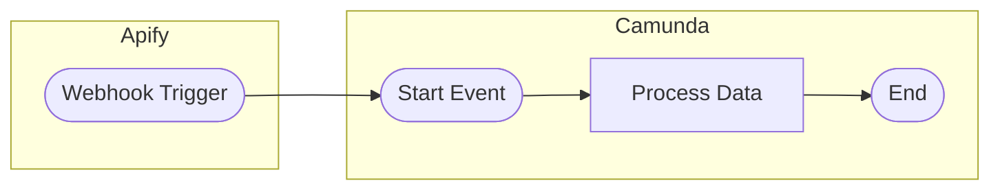

1. Create a new **BPMN diagram** and add an **Apify Connector** as the start event.

<p align="center"></p>

2. Configure the connector with your Apify API token, resource type (Actor or Task), and the Actor/Task ID.
3. Optionally set a **Result Variable** (e.g., `webhookData`) to store the webhook payload, or a **Result Expression** to extract specific fields.
4. **Deploy** the process (do not use Play mode, see [Deploy vs Play Mode](#deploy-vs-play-mode) below).
5. Trigger the event from Apify (e.g., run the Actor). The webhook creates a new process instance automatically.

For full configuration details, see [Start Event](README.md#start-event) in the README.

---

#### Message Start Event

The Message Start Event works similarly to the plain Start Event, each incoming webhook creates a new process instance, but it adds Camunda's **message correlation** mechanism on top. This prevents duplicate process instances for the same correlation key and allows you to start **embedded subprocesses** from an Apify event.

**When to use instead of Start Event:**
- You need deduplication: only one process instance per unique run ID
- You want to trigger an embedded subprocess inside an already-running process

**Typical flow:**

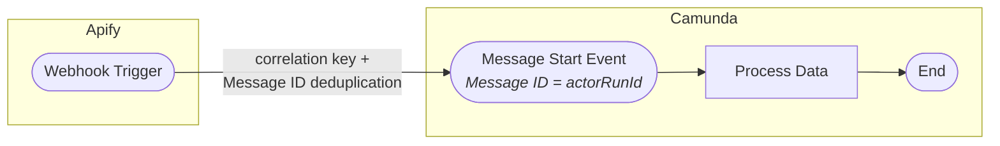

**Setting it up:**

1. Create a new **BPMN diagram** and change the start event to a **Message Start Event** (envelope icon). Then apply the **Apify Message Start Event Connector** template.

<p align="center">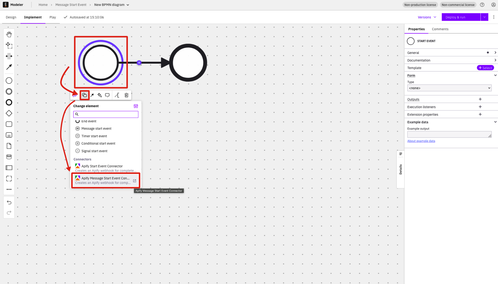</p>

2. Configure the connector with your Apify API token, resource type, and Actor/Task ID (same as Start Event).
3. If you need subprocess correlation, set **Subprocess Correlation Required** to `Correlation required` and fill in the **Correlation Key (Process)** and **Correlation Key (Payload)** fields.
4. Set the **Message ID Expression** to a unique value from the webhook payload (e.g., `=connectorData.eventData.actorRunId`). Camunda uses this ID to deduplicate messages — if a webhook with the same Message ID arrives twice, the second one is silently ignored. This prevents the same Actor run from creating duplicate process instances.
<p align="center">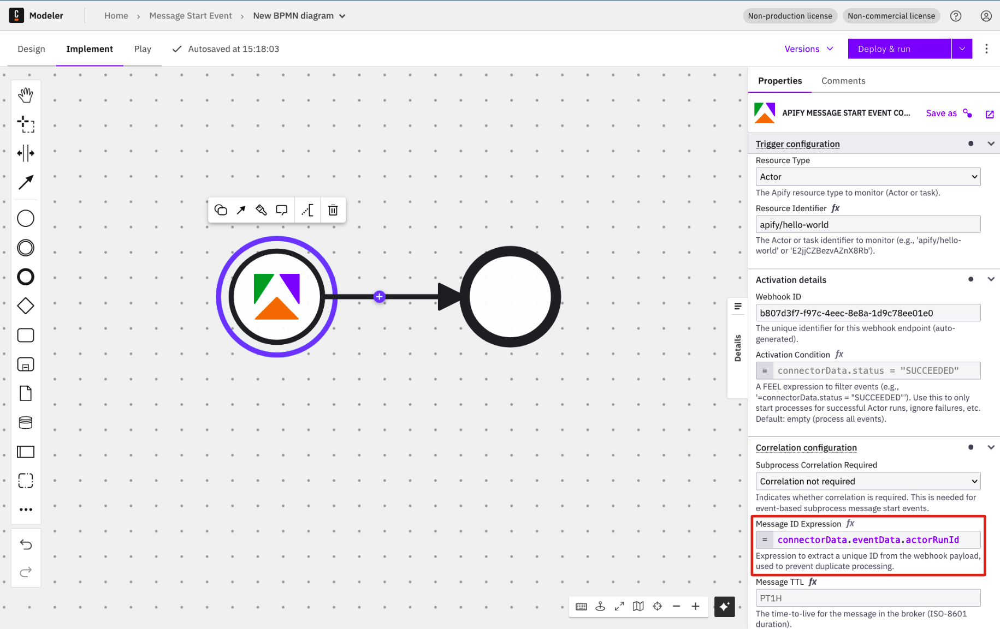</p>

5. **Deploy** the process (do not use Play mode for start events).
6. Trigger the event from Apify. The webhook creates a new process instance through message correlation.

For full configuration details, see [Message Start Event](README.md#message-start-event) in the README.

---

#### Intermediate Catch Event

The Intermediate Catch Event **pauses** the process flow and waits for a webhook from Apify before continuing. The process token sits at the catch event until the matching webhook arrives.

**Typical flow:**

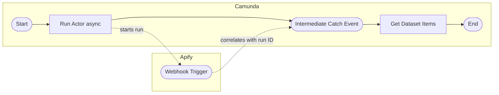

1. The outbound step runs an Actor with **Wait for Finish** = `false` and stores the Actor run response in `previousActorRunResult`.

<p align="center">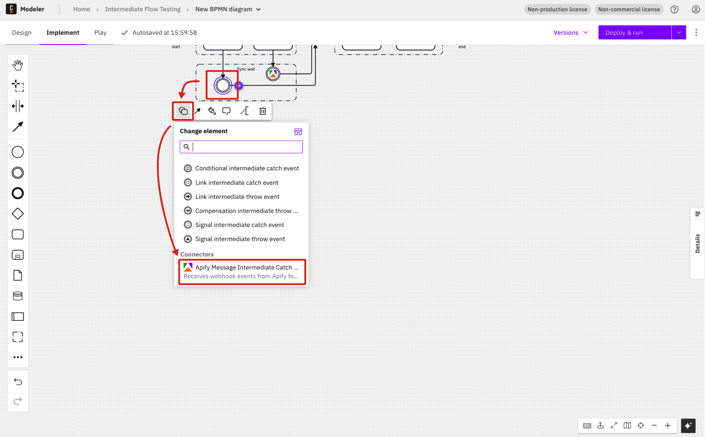</p>

2. The Intermediate Catch Event waits for a webhook where `connectorData.runId` matches `previousActorRunResult.data.id`.

<p align="center">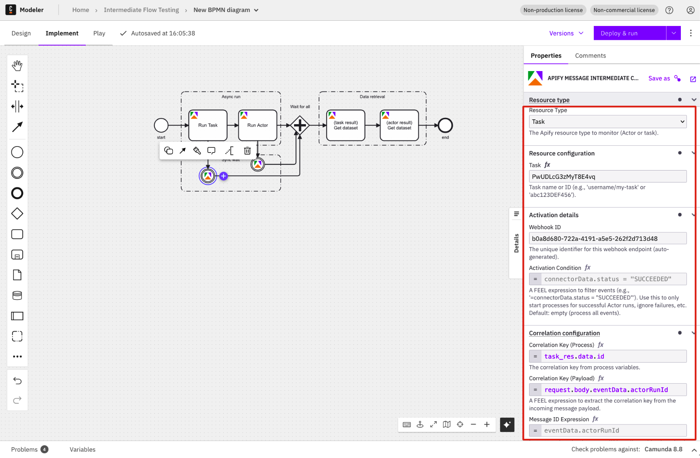</p>

3. Once the Actor finishes and the webhook arrives, the process continues.

For full configuration details, see [Intermediate Catch Event](README.md#intermediate-catch-event) in the README. For the full webhook payload reference, see [Webhook Payload Structure](README.md#webhook-payload-structure).

---

#### Boundary Event

A Boundary Event is **attached to an activity** (e.g., a user task or subprocess) and fires when a matching webhook arrives **while that activity is still running**. Unlike the Intermediate Catch Event, it does not pause the flow, it reacts to an external signal alongside or instead of the activity it is attached to.

**When to use:**
- **Interrupting**: cancel a running activity when an Apify run fails, times out, or completes (e.g., abort a manual review task when the scrape finishes)
- **Non-interrupting**: spawn a parallel path without stopping the activity (e.g., send a progress notification while a long-running task continues)

**Example flow (interrupting):**

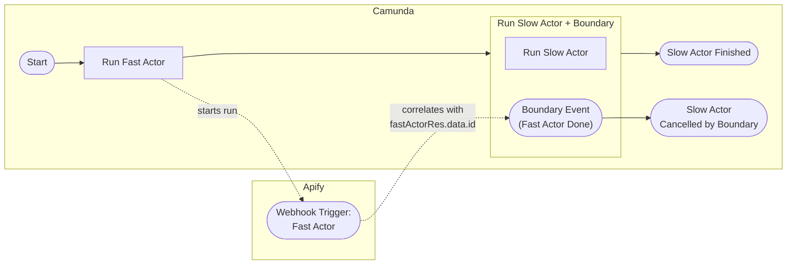

If the fast Actor finishes while the slow Actor is still running, the boundary event interrupts the slow Actor and redirects the flow to a cancellation path.

> **Tip:** If you need the run results (dataset, key-value store) after the Apify event, use the [Async Execution with Parallel Gateway](README.md#async-execution-with-parallel-gateway) pattern with an Intermediate Catch Event instead. The Boundary Event pattern is best when you want to **react** to an event (failure, timeout, status change) rather than **collect** its output.

**Setting it up:**

1. In the BPMN diagram, attach a **Boundary Event** to the target activity (e.g., a user task or service task). Then apply the **Apify Boundary Event Connector** template.

2. Configure the connector with your Apify API token, resource type, and Actor/Task ID.

<p align="center">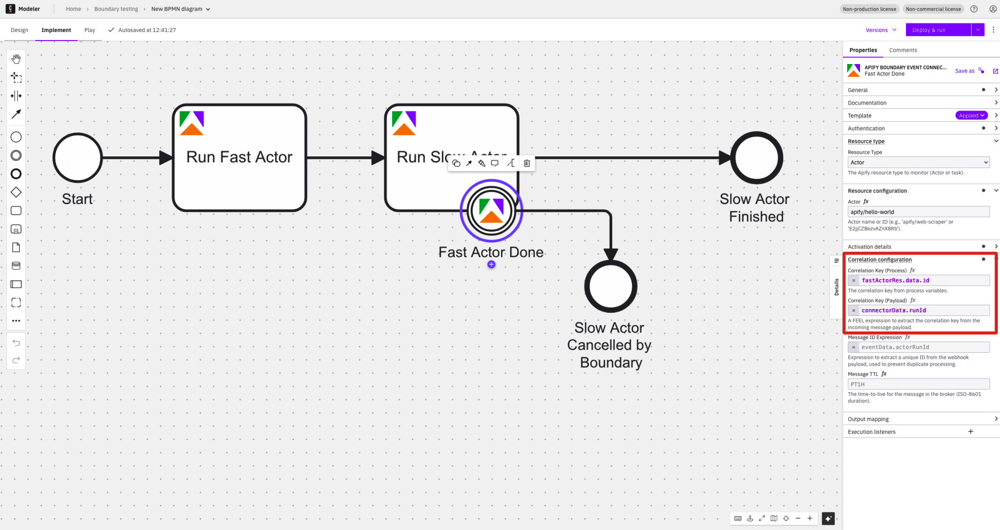</p>

3. Set the **Correlation Key (Process)** to match a process variable (e.g., `=previousActorRunResult.data.id`) and **Correlation Key (Payload)** to match the webhook field (e.g., `=connectorData.runId`).
4. Choose whether the boundary event is **interrupting** (terminates the activity) or **non-interrupting** (activity continues).
5. **Test the flow in Play mode:**  
   - You can quickly test your boundary event or intermediate event setup using Play mode in Camunda Web Modeler.
   - Follow the steps described in the [Deploy vs Play Mode](#deploy-vs-play-mode) section above to run your process and verify its behavior.
   - Once completed, review your instance, tokens, and process variables in the instance history panel.
<p align="center">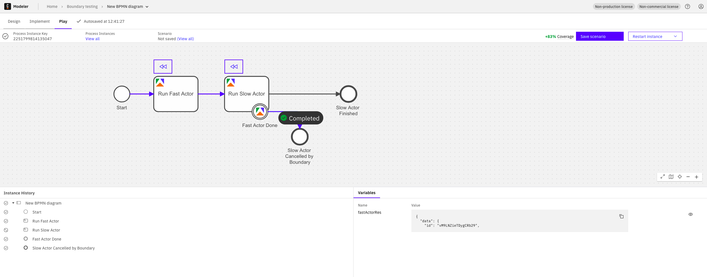</p>

For full configuration details, see [Boundary Event](README.md#boundary-event) in the README. For the full webhook payload reference, see [Webhook Payload Structure](README.md#webhook-payload-structure).

---

#### Webhook Payload and Correlation

Both the Intermediate Catch Event and Boundary Event connectors operate within a **running** process and require **correlation keys** to match an incoming webhook to the correct process instance.

**Understanding the webhook payload:**

When Apify sends a webhook, the connector receives this payload structure:

```json
{
  "connectorData": {
    "eventType": "ACTOR.RUN.SUCCEEDED",
    "userId": "user1234",
    "createdAt": "2026-01-03T12:00:00.000Z",
    "runId": "efgh5678",
    "status": "SUCCEEDED",
    "actorId": "abcd1234",
    "defaultDatasetId": "d9E0f1G2h3I4j5K6",
    "eventData": {
      "actorId": "abcd1234",
      "actorRunId": "efgh5678"
    },
    "resource": {
      "id": "efgh5678",
      "status": "SUCCEEDED",
      "stats": { "..." },
      "options": { "..." },
      "..."
    }
  },
  "request": {
    "body": {
      "eventType": "ACTOR.RUN.SUCCEEDED",
      "resource": { "..." }
    },
    "headers": { "..." }
  }
}
```

> **Note:** The `connectorData.resource` field contains the **same Actor Run object** that the outbound Run Actor / Run Task operations return (the `data` envelope contents described [above](#outbound-connector)). This means you can access fields like `id`, `status`, `defaultDatasetId`, and `defaultKeyValueStoreId` directly from the webhook payload without making a separate API call.

For more info on the raw Apify webhook payload and available variables, see the [Default payload example](https://docs.apify.com/platform/integrations/webhooks/actions#default-payload-example) in the Apify docs.

**How correlation works:**

Correlation keys tell Camunda which waiting process instance should receive the webhook. You set two values that must match:

- **Correlation Key (Process)**: a FEEL expression that reads from a process variable, e.g., `=previousActorRunResult.data.id` (the Actor run ID saved by a previous outbound step)
- **Correlation Key (Payload)**: a FEEL expression that reads from the incoming webhook, e.g., `=connectorData.runId`

When the webhook arrives, Camunda compares these two values. If they match, the correct process instance resumes. If they don't match exactly, the process stays stuck waiting.

**Result Expression (optional):**

The **Result Expression** is not required. If omitted, the full webhook payload is stored as-is in the result variable. When provided, it acts as a FEEL transformation that lets you extract, rename, or restructure fields before they are stored as process variables. This is useful for keeping your process variables clean and only carrying forward the data you need.

Examples:
- `={ datasetId: connectorData.defaultDatasetId, status: connectorData.status }`: extract only specific fields into named variables
- `={ result: connectorData }`: wrap the connector data under a single key
- `={ runId: connectorData.runId, items: connectorData.resource }`: combine fields from different parts of the payload

---

#### Deploy vs Play Mode

Once your process is configured, you need to deploy or play it:

- **Deploy**: Creates a persistent webhook in Apify. Use this for processes with inbound start events (Start Event, Message Start Event), deploy without running, then trigger from Apify.
- **Play**: Runs the process immediately in a sandbox with temporary webhooks. Use this for outbound flows or flows with intermediate/boundary inbound events (not inbound start events, Play skips them and webhook variables won't be set).

<p align="center"></p>

| Mode | Webhooks | Best For |
|------|----------|----------|
| **Play mode** | Temporary (deleted after run) | Outbound flows, intermediate/boundary inbound events |
| **Deploy** (without Run) | Persistent (keep listening) | Inbound start events |
| **Deploy & Run** | Persistent | Flows starting with outbound steps (first instance runs immediately) |

**How to use Play mode:**
1. Click the **Play** tab (next to Design and Implement) in Web Modeler.
2. Click **Start instance with cached data** to run immediately, or open the menu to edit variables before starting.

<p align="center"></p>

3. View the results directly in the Modeler: the **Instance History** panel shows the path taken, and the **Variables** panel shows all process data.
4. Optionally click **Save scenario** to store this run. You can rerun saved scenarios later and update them as the process evolves. The coverage indicator shows what percentage of your process flow nodes are covered by saved scenarios (see [Scenario coverage](https://docs.camunda.io/docs/components/modeler/web-modeler/play-your-process/#scenario-coverage)).

<p align="center"></p>

---

## Reference

### Project Structure

```
├── src/
│   ├── main/java/io/camunda/connector/apify/
│   │   ├── common/           # Shared utilities (ApifyClient, etc.)
│   │   │   └── dto/          # Common DTOs (Authentication, etc.)
│   │   ├── inbound/          # Inbound connector implementation
│   │   │   └── dto/          # Inbound DTOs (webhook payload, etc.)
│   │   └── outbound/         # Outbound connector implementation
│   │       └── dto/          # Outbound DTOs (request/response objects)
│   └── test/
│       ├── java/             # Unit and integration tests
│       └── resources/        # Test configuration
├── element-templates/        # Camunda element templates (JSON)
├── docs/
│   ├── modeler/              # Web Modeler screenshots
│   └── operate/              # Camunda Operate screenshots
└── pom.xml                   # Maven configuration
```

### Regenerating Element Templates

The templates in `element-templates/` were generated and then customized for Apify. We use four inbound and one outbound template.

If you want to regenerate the original (base) templates, use the command below:

> **Warning:** Apify-specific customizations may be lost when regenerating.

```bash
# Use only if necessary
mvn clean package -Dgenerate.templates=true
```

### Camunda Architecture

The Camunda platform consists of several services:

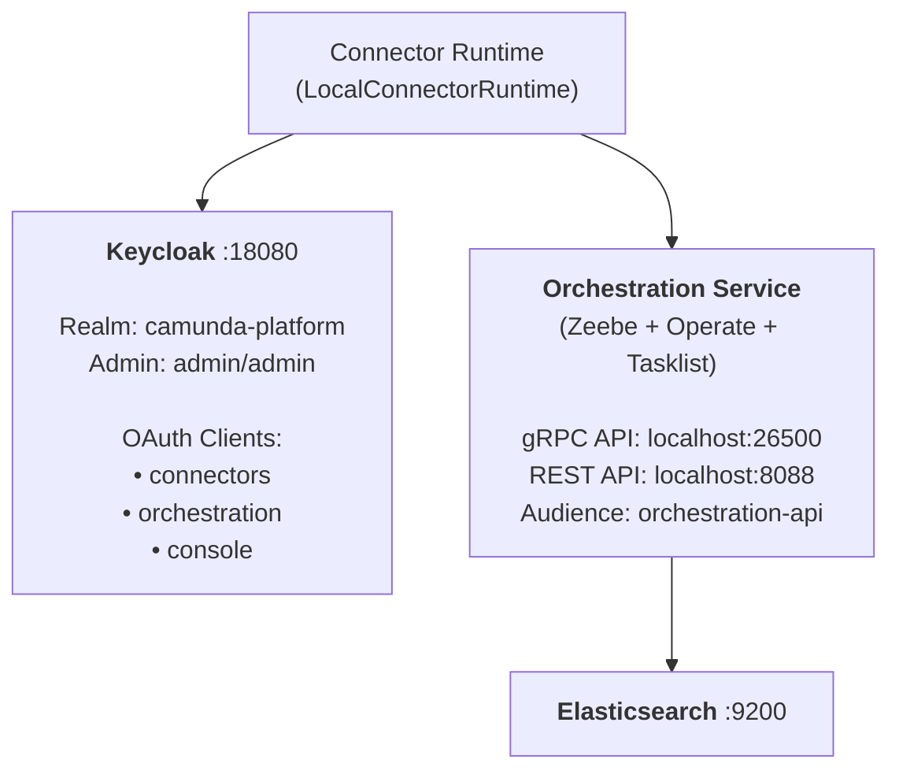

**Components:**

- **Orchestration Service** - Core workflow engine containing:
  - **Zeebe** - Executes BPMN processes, handles job workers, manages process state
  - **Operate** - Web UI for monitoring processes and investigating incidents
  - **Tasklist** - Web UI for managing human tasks

- **Keycloak** - Identity provider for OAuth 2.0 / OIDC authentication

- **Elasticsearch** - Stores process execution data for Operate and Tasklist

- **Web Modeler** - Browser-based BPMN diagram editor

- **Connector Runtime** - Executes connector logic (outbound API calls, inbound webhooks)

### Service URLs

| Service | URL | Credentials | Purpose |
|---------|-----|-------------|---------|
| **Web Modeler** | http://localhost:8070/ | `demo` / `demo` | BPMN diagram editor |
| **Operate/Tasklist** | http://localhost:8088/ | `demo` / `demo` | Process monitoring |
| **Console** | http://localhost:8087/ | `demo` / `demo` | Cluster management |
| **Optimize** | http://localhost:8083/ | `demo` / `demo` | Process analytics |
| **Identity** | http://localhost:8084/ | - | User/role management |
| **Keycloak Admin** | http://localhost:18080/auth/admin | `admin` / `admin` | OAuth configuration |
| **Elasticsearch** | http://localhost:9200/ | - | Data storage |
| **Mailpit** | http://localhost:8075/ | - | Email testing |

> **Note:** For API endpoints and Keycloak OAuth client configuration details, see [`src/test/resources/application.properties`](src/test/resources/application.properties).

### Troubleshooting

#### Common Development Issues

| Issue | Solution |
|-------|----------|
| Webhook not received | Ensure ngrok is running and `CONNECTOR_BASE_URL` is set to the ngrok URL |
| Process not visible in Operate | Check the **Finished** filter - completed processes may not show in default view |
| Connector crashes on startup | Ensure `CONNECTOR_BASE_URL` environment variable is set |
| `ProcessDefinitionImporter` errors | Ensure `audience=orchestration-api` in config (not `zeebe-api`) |
| `Failed to apply credentials` (400) | Check OAuth client credentials match Keycloak config |
| gRPC connection failed | Ensure `grpc-address` uses `grpc://` protocol (not `http://`) |

#### Cleaning Up Stale Webhooks

During testing, you may accumulate webhooks. To start fresh, reset your Camunda Docker Compose stack.

Navigate to the directory where you extracted the [Camunda Docker Compose distribution](https://github.com/camunda/camunda-distributions/releases/tag/docker-compose-8.8) and run:

```bash
cd docker-compose-8.8
docker compose -f docker-compose-full.yaml down -v
docker compose -f docker-compose-full.yaml up -d
```

> **Warning:** This deletes all data including deployed processes and webhooks. Webhooks created in Apify must be deleted manually in the Apify Console.

### Code Style

- Use **Java 21** features (records, pattern matching, etc.)
- Follow **Java naming conventions** (PascalCase for classes, camelCase for methods/variables)
- Use **records** for immutable DTOs
- Use **SLF4J** for logging (never `System.out.println`)
- Write tests using **JUnit 5**, **Mockito**, and **AssertJ**
- Follow **Given-When-Then** structure in tests
- Never log sensitive information (tokens, passwords)
