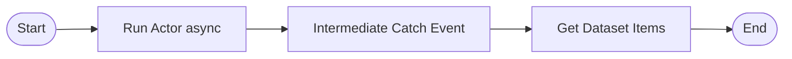
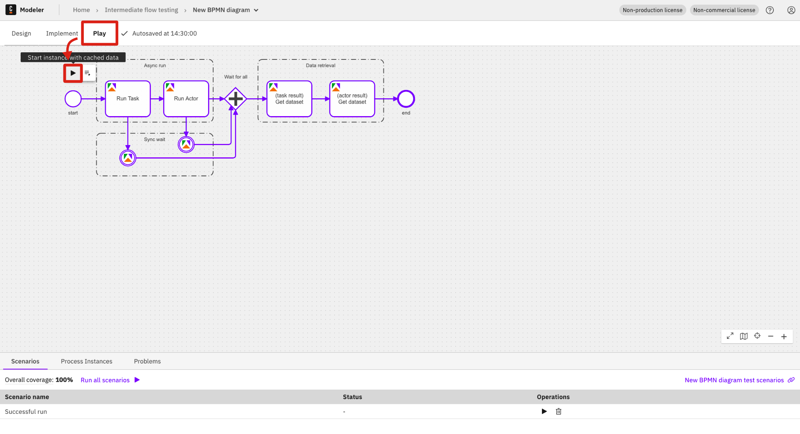

# Contributing to Apify Camunda Connector

This guide covers how to set up the development environment, run the connector locally, and contribute to the project.

## Table of Contents

- [Prerequisites](#prerequisites)
- [Quick Start](#quick-start)
- [Running the Connector](#running-the-connector)
  - [Environment Variables](#environment-variables)
  - [Start Command](#start-command)
- [Development](#development)
  - [Project Structure](#project-structure)
  - [Regenerating Element Templates](#regenerating-element-templates)
  - [Running Tests](#running-tests)
- [Camunda Architecture](#camunda-architecture)
  - [Service URLs](#service-urls)
- [Troubleshooting](#troubleshooting)
  - [Common Development Issues](#common-development-issues)
  - [Cleaning Up Stale Webhooks](#cleaning-up-stale-webhooks)
- [Testing in the Modeler](#testing-in-the-modeler)
  - [Outbound Connector](#outbound-connector)
  - [Inbound Connectors](#inbound-connectors)

---

## Prerequisites

- **Java 21** or later
- **Maven 3.8+**
- **Docker** and **Docker Compose**

---

## Quick Start

### 1. Start Camunda Stack

Follow the [Camunda Docker Compose quickstart](https://docs.camunda.io/docs/self-managed/quickstart/developer-quickstart/docker-compose) to spin up the full stack locally.

> **Note:** Install the **fully** configured stack which includes Web Modeler. This connector was tested with [Camunda 8.8](https://github.com/camunda/camunda-distributions/releases/tag/docker-compose-8.8).

### 2. Clone and Build

```bash
git clone https://github.com/apify/apify-camunda-integration.git
cd apify-camunda-integration
mvn clean package
```

### 3. Run the Connector

> **Note:** If you plan to use **inbound connectors** (webhooks), set `CONNECTOR_BASE_URL` first. See [Environment Variables](#environment-variables) for details.

```bash
mvn test-compile exec:java \
  -Dexec.mainClass="io.camunda.connector.apify.LocalConnectorRuntime" \
  -Dexec.classpathScope=test
```

### 4. Open Web Modeler

Go to http://localhost:8070/ (credentials: `demo` / `demo`) and start creating processes with the Apify connector.

---

## Running the Connector

This section covers how to run the connector locally. The same command is used for both outbound and inbound connectors.

### Environment Variables

For **inbound connectors** (webhooks), you must set `CONNECTOR_BASE_URL` so Apify knows where to send webhook events.

**Option A: Placeholder URL (for initial setup)**

```bash
export CONNECTOR_BASE_URL=http://example.com
```

You can update the webhook URL in Apify later after deploying your process.

**Option B: Using ngrok (recommended for testing)**

This approach allows real-time webhook testing without manually updating URLs.

1. Install ngrok from [https://ngrok.com/download/](https://ngrok.com/download/).

2. Start ngrok:
   ```bash
   ngrok http 9898
   ```

3. Copy the generated URL (e.g., `https://abc123.ngrok-free.app`) and set it:
   ```bash
   export CONNECTOR_BASE_URL=https://abc123.ngrok-free.app
   ```

### Start Command

```bash
mvn test-compile exec:java \
  -Dexec.mainClass="io.camunda.connector.apify.LocalConnectorRuntime" \
  -Dexec.classpathScope=test
```

Keep this terminal running while working with Camunda Modeler.

---

## Development

### Project Structure

```
├── src/
│   ├── main/java/io/camunda/connector/apify/
│   │   ├── common/           # Shared utilities (ApifyClient, etc.)
│   │   │   └── dto/          # Common DTOs (Authentication, etc.)
│   │   ├── inbound/          # Inbound connector implementation
│   │   │   └── dto/          # Inbound DTOs (webhook payload, etc.)
│   │   └── outbound/         # Outbound connector implementation
│   │       └── dto/          # Outbound DTOs (request/response objects)
│   └── test/
│       ├── java/             # Unit and integration tests
│       └── resources/        # Test configuration
├── element-templates/        # Camunda element templates (JSON)
├── docs/
│   ├── modeler/              # Web Modeler screenshots
│   └── operate/              # Camunda Operate screenshots
└── pom.xml                   # Maven configuration
```

### Regenerating Element Templates

The templates in `element-templates/` were generated and then customized for Apify. We use four inbound and one outbound template.

If you want to regenerate the original (base) templates, use the command below:

> **Warning:** Apify-specific customizations may be lost when regenerating.

```bash
# Use only if necessary
mvn clean package -Dgenerate.templates=true
```

### Running Tests

```bash
# Run all tests
mvn clean verify

# Run specific test class
mvn test -Dtest=MyFunctionTest

# Run with coverage
mvn clean verify jacoco:report
```

---

## Camunda Architecture

The Camunda platform consists of several services:

```
┌─────────────────────────────────────────────────────────────────────────────┐
│                        Connector Runtime                                    │
│                      (LocalConnectorRuntime)                                │
└─────────────────────────────┬───────────────────────────────────────────────┘
                              │
              ┌───────────────┴───────────────┐
              │                               │
              v                               v
┌─────────────────────────┐       ┌───────────────────────────────────────────┐
│      Keycloak           │       │         Orchestration Service             │
│      :18080             │       │    (Zeebe + Operate + Tasklist)           │
│                         │       │                                           │
│  Realm: camunda-platform│       │   gRPC API: localhost:26500               │
│  Admin: admin/admin     │       │   REST API: localhost:8088                │
│                         │       │                                           │
│  OAuth Clients:         │       │   Audience: orchestration-api             │
│  - connectors           │       │                                           │
│  - orchestration        │       └───────────────────────────────────────────┘
│  - console              │                         │
└─────────────────────────┘                         │
                                                    v
                                        ┌───────────────────────┐
                                        │    Elasticsearch      │
                                        │       :9200           │
                                        └───────────────────────┘
```

**Components:**

- **Orchestration Service** - Core workflow engine containing:
  - **Zeebe** - Executes BPMN processes, handles job workers, manages process state
  - **Operate** - Web UI for monitoring processes and investigating incidents
  - **Tasklist** - Web UI for managing human tasks

- **Keycloak** - Identity provider for OAuth 2.0 / OIDC authentication

- **Elasticsearch** - Stores process execution data for Operate and Tasklist

- **Web Modeler** - Browser-based BPMN diagram editor

- **Connector Runtime** - Executes connector logic (outbound API calls, inbound webhooks)

### Service URLs

| Service | URL | Credentials | Purpose |
|---------|-----|-------------|---------|
| **Web Modeler** | http://localhost:8070/ | `demo` / `demo` | BPMN diagram editor |
| **Operate/Tasklist** | http://localhost:8088/ | `demo` / `demo` | Process monitoring |
| **Console** | http://localhost:8087/ | `demo` / `demo` | Cluster management |
| **Optimize** | http://localhost:8083/ | `demo` / `demo` | Process analytics |
| **Identity** | http://localhost:8084/ | - | User/role management |
| **Keycloak Admin** | http://localhost:18080/auth/admin | `admin` / `admin` | OAuth configuration |
| **Elasticsearch** | http://localhost:9200/ | - | Data storage |
| **Mailpit** | http://localhost:8075/ | - | Email testing |

> **Note:** For API endpoints and Keycloak OAuth client configuration details, see [`src/test/resources/application.properties`](src/test/resources/application.properties).

---

## Troubleshooting

### Common Development Issues

| Issue | Solution |
|-------|----------|
| Webhook not received | Ensure ngrok is running and `CONNECTOR_BASE_URL` is set to the ngrok URL |
| Process not visible in Operate | Check the **Finished** filter - completed processes may not show in default view |
| Connector crashes on startup | Ensure `CONNECTOR_BASE_URL` environment variable is set |
| `ProcessDefinitionImporter` errors | Ensure `audience=orchestration-api` in config (not `zeebe-api`) |
| `Failed to apply credentials` (400) | Check OAuth client credentials match Keycloak config |
| gRPC connection failed | Ensure `grpc-address` uses `grpc://` protocol (not `http://`) |

### Cleaning Up Stale Webhooks

During testing, you may accumulate webhooks. To start fresh, reset your Camunda Docker Compose stack.

Navigate to the directory where you extracted the [Camunda Docker Compose distribution](https://github.com/camunda/camunda-distributions/releases/tag/docker-compose-8.8) and run:

```bash
cd docker-compose-8.8
docker compose -f docker-compose-full.yaml down -v
docker compose -f docker-compose-full.yaml up -d
```

> **Warning:** This deletes all data including deployed processes and webhooks. Webhooks created in Apify must be deleted manually in the Apify Console.

---

## Testing in the Modeler

### Outbound Connector

1. Go to **Web Modeler** (http://localhost:8070/) and create a new project.


2. Upload the outbound connector template:
   - Template file: `element-templates/apify-outbound-connector.json`


3. **Publish** the connector template to the project.


4. Create a new **BPMN diagram**.


5. Design a process using the **Apify BPMN connector** as a service task.


6. Set the connector input variables and run the process.


7. Verify the run status and result in **Camunda Operate** (http://localhost:8088/).


**Understanding the outbound response data:**

The **Run Actor** and **Run Task** operations return the full Actor run object as the result variable. This object contains fields like `id`, `status`, `defaultDatasetId`, `defaultKeyValueStoreId`, and more. Knowing this structure is important because subsequent steps (e.g., Get Dataset Items) and inbound correlation keys reference these fields.

For the full response schema, see:
- [Run Actor API](https://docs.apify.com/api/v2/act-runs-post): response for `Run Actor`
- [Run Task API](https://docs.apify.com/api/v2/actor-task-runs-post): response for `Run Task`

Key fields you'll use in testing:

| Field | Example FEEL expression | What it contains |
|-------|------------------------|-----------------|
| `id` | `=runResult.id` | The run ID (used for correlation) |
| `status` | `=runResult.status` | Run status (`RUNNING`, `SUCCEEDED`, `FAILED`, etc.) |
| `defaultDatasetId` | `=runResult.defaultDatasetId` | Dataset ID (pass to Get Dataset Items) |
| `defaultKeyValueStoreId` | `=runResult.defaultKeyValueStoreId` | Key-value store ID (pass to Get Key-Value Store Record) |

### Inbound Connectors

#### Setup (shared across all inbound types)

1. Upload the inbound connector templates:
   - **Start Event**: `element-templates/apify-connector-start-event.json`
   - **Message Start Event**: `element-templates/apify-connector-message-start-event.json`
   - **Intermediate Catch Event**: `element-templates/apify-connector-intermediate-catch-event.json`
   - **Boundary Event**: `element-templates/apify-connector-boundary-event.json`

2. **Publish** all templates to the project.


#### Start Event

The simplest inbound connector, each incoming webhook creates a new process instance. No correlation needed.

1. Create a new **BPMN diagram** and add an **Apify Connector** as the start event.


2. Configure the connector with your Apify API token, resource type (Actor or Task), and the Actor/Task ID.
3. Optionally set a **Result Variable** (e.g., `webhookData`) to store the webhook payload, or a **Result Expression** to extract specific fields.
4. **Deploy** the process (do not use Play mode, see [Deploy vs Play Mode](#deploy-vs-play-mode) below).
5. Trigger the event from Apify (e.g., run the Actor). The webhook creates a new process instance automatically.

For full configuration details, see [Start Event](README.md#start-event) in the README.

#### Message Start Event

Like Start Event, but uses Camunda's message correlation to prevent duplicate instances and supports starting subprocesses. Configuration is the same as Start Event, plus optional correlation key fields.

For full configuration details, see [Message Start Event](README.md#message-start-event) in the README.

#### Intermediate Catch Event & Boundary Event

These connectors pause or react to a webhook within a **running** process. They require **correlation keys** to match the incoming webhook to the correct process instance.

**Understanding the webhook payload:**

When Apify sends a webhook, the connector receives this payload structure:

```json
{
  "connectorData": {
    "eventType": "ACTOR.RUN.SUCCEEDED",
    "userId": "user1234",
    "createdAt": "2026-01-03T12:00:00.000Z",
    "runId": "efgh5678",
    "status": "SUCCEEDED",
    "actorId": "abcd1234",
    "defaultDatasetId": "d9E0f1G2h3I4j5K6",
    "eventData": {
      "actorId": "abcd1234",
      "actorRunId": "efgh5678"
    },
    "resource": {
      "id": "efgh5678",
      "status": "SUCCEEDED",
      "stats": { "..." },
      "options": { "..." },
      "usage": { "..." }
    }
  },
  "request": {
    "body": {
      "eventType": "ACTOR.RUN.SUCCEEDED",
      "resource": { "..." }
    },
    "headers": { "..." }
  }
}
```

For more info on the raw Apify webhook payload and available variables, see the [Default payload example](https://docs.apify.com/platform/integrations/webhooks/actions#default-payload-example) in the Apify docs.

**How correlation works:**

Correlation keys tell Camunda which waiting process instance should receive the webhook. You set two values that must match:

- **Correlation Key (Process)**: a FEEL expression that reads from a process variable, e.g., `=runResult.id` (the Actor run ID saved by a previous outbound step)
- **Correlation Key (Payload)**: a FEEL expression that reads from the incoming webhook, e.g., `=connectorData.runId`

When the webhook arrives, Camunda compares these two values. If they match, the correct process instance resumes. If they don't match exactly, the process stays stuck waiting.

**Typical flow:**



1. The outbound step runs an Actor with **Wait for Finish** = `false` and stores the Actor run response in `runResult`.
2. The Intermediate Catch Event waits for a webhook where `connectorData.runId` matches `runResult.id`.
3. Once the Actor finishes and the webhook arrives, the process continues.

For full configuration details, see [Intermediate Catch Event](README.md#intermediate-catch-event) and [Boundary Event](README.md#boundary-event) in the README. For the full webhook payload reference, see [Webhook Payload Structure](README.md#webhook-payload-structure).

#### Deploy vs Play Mode

Once your process is configured, you need to deploy or play it:

- **Deploy**: Creates a persistent webhook in Apify. Use this for processes with inbound start events (Start Event, Message Start Event), deploy without running, then trigger from Apify.
- **Play**: Runs the process immediately in a sandbox with temporary webhooks. Use this for outbound flows or flows with intermediate/boundary inbound events (not inbound start events, Play skips them and webhook variables won't be set).


| Mode | Webhooks | Best For |
|------|----------|----------|
| **Play mode** | Temporary (deleted after run) | Outbound flows, intermediate/boundary inbound events |
| **Deploy** (without Run) | Persistent (keep listening) | Inbound start events |
| **Deploy & Run** | Persistent | Flows starting with outbound steps (first instance runs immediately) |

**How to use Play mode:**
1. Click the **Play** tab (next to Design and Implement) in Web Modeler.
2. Click **Start instance with cached data** to run immediately, or open the menu to edit variables before starting.



3. View the results directly in the Modeler: the **Instance History** panel shows the path taken, and the **Variables** panel shows all process data.
4. Optionally click **Save scenario** to store this run. You can rerun saved scenarios later and update them as the process evolves. The coverage indicator shows what percentage of your process flow nodes are covered by saved scenarios (see [Scenario coverage](https://docs.camunda.io/docs/components/modeler/web-modeler/play-your-process/#scenario-coverage)).


---

## Code Style

- Use **Java 21** features (records, pattern matching, etc.)
- Follow **Java naming conventions** (PascalCase for classes, camelCase for methods/variables)
- Use **records** for immutable DTOs
- Use **SLF4J** for logging (never `System.out.println`)
- Write tests using **JUnit 5**, **Mockito**, and **AssertJ**
- Follow **Given-When-Then** structure in tests
- Never log sensitive information (tokens, passwords)
