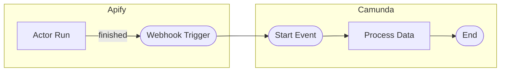
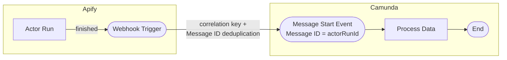
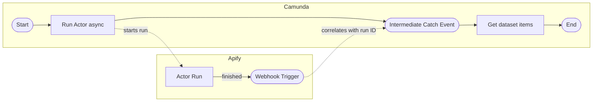
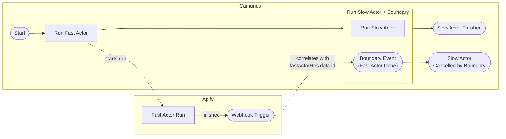
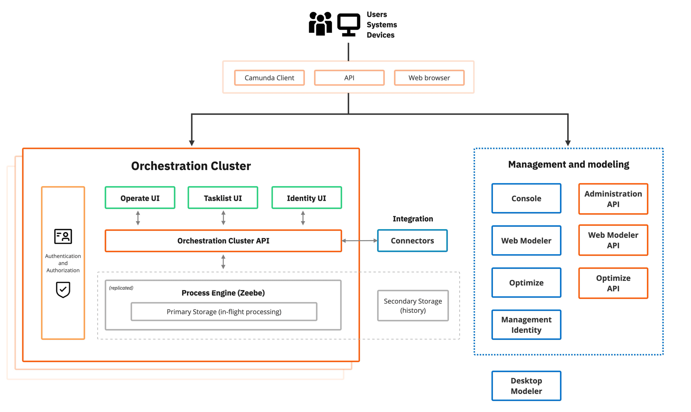

# Contributing to Apify Camunda Connector

This guide walks you through setting up the development environment, running and testing the connector, and contributing to the project.

> **Looking for reference material?** Project structure, Camunda architecture, service URLs, troubleshooting, and code style guidelines are in the [Reference](#reference) section at the bottom.

## Table of Contents

- [Prerequisites](#prerequisites)
- [Quick Start](#quick-start)
- [Running the Connector](#running-the-connector)
  - [Start Command](#start-command)
  - [Local inbound setup with ngrok](#local-inbound-setup-with-ngrok)
- [Running Tests](#running-tests)
- [Testing in the Modeler](#testing-in-the-modeler)
  - [Outbound Connector](#outbound-connector)
  - [Inbound Connectors](#inbound-connectors)
    - [Activation Condition](#activation-condition)
    - [Start Event](#start-event)
    - [Message Start Event](#message-start-event)
    - [Intermediate Catch Event](#intermediate-catch-event)
    - [Boundary Event](#boundary-event)
    - [Webhook Payload and Correlation](#webhook-payload-and-correlation)
    - [Deploy vs Play Mode](#deploy-vs-play-mode)
- [Contributing Workflow](#contributing-workflow)
- [Releasing](#releasing)
  - [Element template version policy](#element-template-version-policy)
  - [Submitted template URLs](#submitted-template-urls)
  - [Distribution channels](#distribution-channels)
- [Reference](#reference)
  - [Project Structure](#project-structure)
  - [Regenerating Element Templates](#regenerating-element-templates)
  - [Camunda Architecture](#camunda-architecture)
  - [Service URLs](#service-urls)
  - [Troubleshooting](#troubleshooting)
  - [Code Style](#code-style)

---

## Prerequisites

- **Camunda 8.8 or 8.9**: clone the [camunda-distributions](https://github.com/camunda/camunda-distributions) repo, which contains Docker Compose files for every supported Camunda version. Use the **full** variant (`docker-compose-full.yaml`), which includes Web Modeler.
- **Java 21** or later
- **Maven 3.8+**
- **Docker** and **Docker Compose**
- **Apify account** (free tier): [sign up here](https://console.apify.com/sign-up)
- **Apify API token**: find it at [Settings → Integrations](https://console.apify.com/settings/integrations) in the Apify Console

> **Tip:** For testing throughout this guide, we use the public [`apify/hello-world`](https://apify.com/apify/hello-world) Actor, which completes quickly and requires no special configuration.

> **Tip:** You can also use [Camunda Desktop Modeler](https://docs.camunda.io/docs/components/modeler/desktop-modeler/install-the-modeler/) instead of Web Modeler. It connects directly to the local Zeebe instance and is a lightweight alternative when you only need to edit BPMN files. This guide defaults to the **full** Docker Compose variant because it bundles the complete Self-Managed stack (Web Modeler, Operate, Tasklist, Identity, Keycloak), which better mirrors production environments.

---

## Quick Start

### 1. Start Camunda Stack

Clone the [camunda-distributions](https://github.com/camunda/camunda-distributions) repo, switch into the folder for the Camunda version you want to run, and start the **full** variant (which includes Web Modeler):

```bash
git clone https://github.com/camunda/camunda-distributions.git
cd camunda-distributions/docker-compose/versions/camunda-8.9
docker compose -f docker-compose-full.yaml up -d
```

> **Picking a version:** The `docker-compose/versions/` directory contains a folder per Camunda minor version. The connector officially supports **8.8** and **8.9**. Swap the path segment to match the version you want to verify against.

> **Port note:** All `localhost` URLs in this guide assume **Camunda 8.9** ports. If you are running **8.8**, swap `:8080` → `:8088` for the Orchestration REST endpoint.

The stack takes **2–5 minutes** to start. Wait until http://localhost:8070/ shows the Web Modeler login page before proceeding.

> **Note:** Docker Desktop needs at least **8 GB of RAM** allocated (Settings → Resources). If containers keep crashing, increase the memory limit. For a detailed walkthrough, see the [Camunda Docker Compose quickstart](https://docs.camunda.io/docs/self-managed/quickstart/developer-quickstart/docker-compose).

### 2. Clone and Build

```bash
git clone https://github.com/apify/apify-camunda-integration.git
cd apify-camunda-integration
mvn clean package
```

### 3. Run the Connector

```bash
mvn test-compile exec:java \
  -Dexec.mainClass="io.camunda.connector.apify.LocalConnectorRuntime" \
  -Dexec.classpathScope=test
```

> **Note:** For **inbound connectors** (webhooks), you also need a publicly reachable URL so Apify can deliver events to your local runtime. See [Local inbound setup with ngrok](#local-inbound-setup-with-ngrok) below.

### 4. Open Web Modeler

Go to http://localhost:8070/ (credentials: `demo` / `demo`) and start creating processes with the Apify connector.

---

## Running the Connector

This section covers how to run the connector locally. The same command is used for both outbound and inbound connectors.

### Start Command

```bash
mvn test-compile exec:java \
  -Dexec.mainClass="io.camunda.connector.apify.LocalConnectorRuntime" \
  -Dexec.classpathScope=test
```

This starts `LocalConnectorRuntime`, a small Spring Boot app that loads the Apify outbound and inbound connectors and listens for incoming webhook POSTs on **port 9898**. The port is set in [`src/test/resources/application.properties`](src/test/resources/application.properties) via `server.port=9898`; it's chosen to avoid conflicts with Camunda's other local services (Zeebe gRPC `:26500`, Orchestration REST `:8080`, Keycloak `:18080`).

**Note:** Keep this terminal running while you work with Camunda Modeler.

### Testing against different Camunda versions

To test the connector against a specific Camunda SDK version, pass `-Dversion.connectors` to override the pom default. If your docker-compose stack exposes the Orchestration REST API on a non-default port, override that too with `-Dcamunda.client.rest-address`:

```bash
# Against Camunda 8.8
mvn test-compile exec:java \
  -Dexec.mainClass="io.camunda.connector.apify.LocalConnectorRuntime" \
  -Dexec.classpathScope=test \
  -Dversion.connectors=8.8.8 \
  -Dcamunda.client.rest-address=http://localhost:8088

# Against Camunda 8.9 (default port 8080)
mvn test-compile exec:java \
  -Dexec.mainClass="io.camunda.connector.apify.LocalConnectorRuntime" \
  -Dexec.classpathScope=test \
  -Dversion.connectors=8.9.0
```

> **Tip:** Check your actual port with `docker ps --format "table {{.Names}}\t{{.Ports}}" | grep orchestration`. The official `camunda-distributions` docker-compose files use `:8080` for both 8.8 and 8.9, but custom or older setups may differ.

### Local inbound setup with ngrok

Inbound (webhook) testing requires Apify to be able to reach your machine over the public internet. The connector reads its public base URL from the **Camunda webhook URL** field on the BPMN element template; there is no environment variable to set. For local development, expose port 9898 via ngrok and paste the ngrok URL into that template field.

1. Install ngrok from [https://ngrok.com/download/](https://ngrok.com/download/).

2. Start ngrok pointing at the local runtime port:
   ```bash
   ngrok http 9898
   ```

3. Copy the generated forwarding URL (e.g., `https://abc123.ngrok-free.app`).

4. In Web Modeler, add one of the Apify inbound element templates to your BPMN diagram. In the **Camunda webhook URL** field of the template, paste the ngrok URL **as-is**, without trailing slash and without `/inbound/...`. The connector composes the full callback URL itself by appending `/inbound/<webhookId>` and registers that URL with Apify on deploy.

5. Deploy the process. The runtime logs should show `Successfully created Apify webhook with webhook ID: <id>`.

> **Note:** This ngrok setup is for local development with `LocalConnectorRuntime`. For end-user installation and production deployment, see the README's [Setting up the connectors runtime](README.md#setting-up-the-connectors-runtime) section.

---

## Running Tests

```bash
# Run all tests
mvn clean verify

# Run specific test class
mvn test -Dtest=MyFunctionTest
```

---

## Testing in the Modeler

### Outbound Connector

1. Go to **Web Modeler** (http://localhost:8070/) and create a new project.

<p align="center"></p>

2. Upload the outbound connector template:
   - Template file: `element-templates/apify-outbound-connector.json`

<p align="center"></p>

3. **Publish** the connector template to the project.

<p align="center"></p>

4. Create a new **BPMN diagram** (Business Process Model and Notation - the visual language Camunda uses to define workflows).

<p align="center"></p>

5. Design a process using the **Apify BPMN connector** as a service task. In Apify, an *Actor* is a serverless program (e.g., a web scraper) and a *Task* is a saved configuration of an Actor with preset inputs.

<p align="center"></p>

6. Set the connector input variables and run the process. For a quick smoke test, use these values:

   | Field | Value |
   |-------|-------|
   | **API Token** | *(your Apify API token from [Prerequisites](#prerequisites))* |
   | **Operation** | `Run Actor` |
   | **Actor** | `apify/hello-world` |
   | **Input Body** | *(Optional)* `={ "message": "Hello from Camunda!" }` |
   | **Wait for Finish** | `true` |

   The process should complete in ~30 seconds. For the full list of operations and settings, see [Outbound Connector](README.md#outbound-connector) in the README.

<p align="center"></p>

7. Find the process in **Camunda Operate** (http://localhost:8080/).

<p align="center"></p>

8. Verify the process result status in **Camunda Operate**.

<p align="center"></p>

#### Understanding the outbound response data

The **Run Actor** and **Run task** API responses wrap the run object inside a `data` envelope, so FEEL access goes through `.data.*` (e.g., `=previousActorRunResult.data.id`). For the full response structure, FEEL expression examples, and how FEEL differs from Camunda secret placeholders, see [Outbound Connector](README.md#outbound-connector) and [Common expressions](README.md#common-expressions) in the README.

```json
{
  "data": {
    "id": "efgh5678",
    "actId": "abcd1234",
    "status": "RUNNING",
    "defaultDatasetId": "d9E0f1G2h3I4j5K6",
    "defaultKeyValueStoreId": "k7L8m9N0o1P2q3R4",
    "...": "full run object fields"
  }
}
```

If your result variable is named `previousActorRunResult`, you can access fields in FEEL using expressions like `=previousActorRunResult.data.id` or `=previousActorRunResult.data.status`. FEEL (Friendly Enough Expression Language) is Camunda's way to reference variables; the `=` prefix marks an expression.

More details:
- [Run Actor API response](https://docs.apify.com/api/v2/act-runs-post)
- [Run task API response](https://docs.apify.com/api/v2/actor-task-runs-post)

Key fields:

| Field | Example FEEL expression | What it contains |
|-------|------------------------|-----------------|
| `id` | `=previousActorRunResult.data.id` | The run ID (used for correlation) |
| `status` | `=previousActorRunResult.data.status` | Run status (`RUNNING`, `SUCCEEDED`, `FAILED`, etc.) |
| `defaultDatasetId` | `=previousActorRunResult.data.defaultDatasetId` | Dataset ID (pass to Get dataset items) |
| `defaultKeyValueStoreId` | `=previousActorRunResult.data.defaultKeyValueStoreId` | Key-value store ID (pass to Get key-value store record) |

### Inbound Connectors

#### Setup (shared across all inbound types)

1. Upload the inbound connector templates:
   - **Start Event**: `element-templates/apify-connector-start-event.json`
   - **Message Start Event**: `element-templates/apify-connector-message-start-event.json`
   - **Intermediate Catch Event**: `element-templates/apify-connector-intermediate-catch-event.json`
   - **Boundary Event**: `element-templates/apify-connector-boundary-event.json`

2. **Publish** all templates to the project.

3. Make sure your local runtime is reachable from the public internet. See [Local inbound setup with ngrok](#local-inbound-setup-with-ngrok). When you configure an inbound element below, paste your ngrok URL into the **Camunda webhook URL** field.

<p align="center"></p>

#### Activation Condition

All inbound connectors include an optional **Activation Condition**, a FEEL expression that filters incoming webhook events before they trigger the connector. The connector subscribes to all terminal event types at once (`SUCCEEDED`, `FAILED`, `TIMED_OUT`, `ABORTED`), so without a condition *every* event triggers the connector. In most workflows, set `=connectorData.status = "SUCCEEDED"` to only react to successful runs. For the full list of filter expressions, see [Activation Condition](README.md#activation-condition) in the README.

**Testing tips:**

- To verify filtering, run an Actor that you expect to fail and confirm that no process instance is created when the condition filters for `SUCCEEDED` only.
- Check the connector runtime logs for `Received Apify webhook payload` messages, these appear regardless of the activation condition, so you can confirm the webhook was delivered even if the condition filtered it out.
- The condition is evaluated by the Camunda runtime *after* the connector's `triggerWebhook` method returns the `connectorData`. You do not need to implement any filtering logic in Java; Camunda handles it automatically based on the `activationCondition` BPMN property.

---

#### Start Event

The simplest inbound connector, each incoming webhook creates a new process instance. No correlation needed.

<div align="center">



</div>

1. Create a new **BPMN diagram** and add an **Apify Connector** as the start event.

<p align="center"></p>

2. Configure the connector with your Apify API token, resource type (Actor or Task), and the Actor/Task ID.
3. Optionally set a **Result Variable** (e.g., `webhookData`) to store the webhook payload, or a **Result Expression** to extract specific fields.
4. **Deploy** the process (do not use Play mode, see [Deploy vs Play Mode](#deploy-vs-play-mode) below).
5. Trigger the event from Apify (e.g., run the Actor). The webhook creates a new process instance automatically.

For full configuration details, see [Start Event](README.md#start-event) in the README.

---

#### Message Start Event

Like the Start Event, but adds Camunda's **message correlation** mechanism to prevent duplicate process instances for the same correlation key and to support starting **embedded subprocesses**. See [Message Start Event](README.md#message-start-event) in the README for when to choose this over a plain Start Event.

<div align="center">



</div>

**Setting it up:**

1. Create a new **BPMN diagram** and change the start event to a **Message Start Event** (envelope icon). Then apply the **Apify Message Start Event Connector** template.

<p align="center"></p>

2. Configure the connector with your Apify API token, resource type, and Actor/Task ID (same as Start Event).
3. If you need subprocess correlation, set **Subprocess Correlation Required** to `Correlation required` and fill in the **Correlation Key (Process)** and **Correlation Key (Payload)** fields.
4. Set the **Message ID Expression** to a unique value from the webhook payload (e.g., `=connectorData.eventData.actorRunId`). Camunda uses this ID to deduplicate messages, if a webhook with the same Message ID arrives twice, the second one is silently ignored. This prevents the same Actor run from creating duplicate process instances.
<p align="center"></p>

5. **Deploy** the process (do not use Play mode for start events).
6. Trigger the event from Apify. The webhook creates a new process instance through message correlation.

For full configuration details, see [Message Start Event](README.md#message-start-event) in the README.

---

#### Intermediate Catch Event

The Intermediate Catch Event **pauses** the process and waits for a matching webhook from Apify before continuing. It uses **correlation keys** to match the webhook to the correct process instance, the key from the webhook payload must exactly match a process variable.

<div align="center">



</div>

1. The outbound step runs an Actor with **Wait for Finish** = `false` and stores the Actor run response in `previousActorRunResult`.

<p align="center"></p>

2. The Intermediate Catch Event waits for a webhook where `connectorData.runId` matches `previousActorRunResult.data.id`.

<p align="center"></p>

3. Once the Actor finishes and the webhook arrives, the process continues.

For full configuration details, see [Intermediate Catch Event](README.md#intermediate-catch-event) in the README. For the full webhook payload reference, see [Webhook Payload Structure](README.md#webhook-payload-structure).

---

#### Boundary Event

A Boundary Event is **attached to an activity** (e.g., a user task or subprocess) and fires when a matching webhook arrives **while that activity is still running**. It can be **interrupting** (terminates the activity) or **non-interrupting** (activity continues). See [Boundary Event](README.md#boundary-event) in the README for when to use each variant.

**Example flow (interrupting):**

<div align="center">



</div>

If the fast Actor finishes while the slow Actor is still running, the boundary event interrupts the slow Actor and redirects the flow to a cancellation path.

**Setting it up:**

1. In the BPMN diagram, attach a **Boundary Event** to the target activity (e.g., a user task or service task). Then apply the **Apify Boundary Event Connector** template.

2. Configure the connector with your Apify API token, resource type, and Actor/Task ID.

<p align="center"></p>

3. Set the **Correlation Key (Process)** to match a process variable (e.g., `=previousActorRunResult.data.id`) and **Correlation Key (Payload)** to match the webhook field (e.g., `=connectorData.runId`).
4. Choose whether the boundary event is **interrupting** (terminates the activity) or **non-interrupting** (activity continues).
5. **Test the flow in Play mode:**  
   - You can quickly test your boundary event or intermediate event setup using Play mode in Camunda Web Modeler.
   - Follow the steps described in the [Deploy vs Play Mode](#deploy-vs-play-mode) section below to run your process and verify its behavior.
   - Once completed, review your instance, tokens, and process variables in the instance history panel.
<p align="center"></p>

For full configuration details, see [Boundary Event](README.md#boundary-event) in the README. For the full webhook payload reference, see [Webhook Payload Structure](README.md#webhook-payload-structure).

---

#### Webhook Payload and Correlation

Both the Intermediate Catch Event and Boundary Event connectors require **correlation keys** to match an incoming webhook to the correct waiting process instance. The key fields you'll use for correlation are:

| Webhook field | Typical use |
|---------------|-------------|
| `connectorData.runId` | Correlation Key (Payload):  match against the run ID from a previous outbound step |
| `connectorData.status` | Check whether the run succeeded, failed, or timed out |
| `connectorData.defaultDatasetId` | Pass to a subsequent Get dataset items step |

**Correlation Key (Process)** reads from a process variable (e.g., `=previousActorRunResult.data.id`), and **Correlation Key (Payload)** reads from the webhook (e.g., `=connectorData.runId`). When the webhook arrives, Camunda compares these two values, if they match, the process resumes. If they don't match exactly, the process remains waiting.

For the full payload schema and all available fields, see [Webhook Payload Structure](README.md#webhook-payload-structure) in the README.

**Debugging correlation mismatches:** If your process is stuck at a catch or boundary event, open **Camunda Operate** (http://localhost:8080/), inspect the process variable value, and compare it with the `connectorData.runId` in the connector runtime logs. The most common issue is a mismatch between the variable name used in the outbound result mapping and the FEEL expression in the correlation key.

---

#### Deploy vs Play Mode

Once your process is configured, you need to deploy or play it:

- **Deploy**: Creates a persistent webhook in Apify. Use this for processes with inbound start events (Start Event, Message Start Event), deploy without running, then trigger from Apify.
- **Play**: Runs the process immediately in a sandbox with temporary webhooks. Use this for outbound flows or flows with intermediate/boundary inbound events (not inbound start events; Play mode skips start events, so webhook variables will not be populated).

<p align="center"></p>

| Mode | Webhooks | Best For |
|------|----------|----------|
| **Play mode** | Temporary (deleted after run) | Outbound flows, intermediate/boundary inbound events |
| **Deploy** (without Run) | Persistent (keep listening) | Inbound start events |
| **Deploy & Run** | Persistent | Flows starting with outbound steps (first instance runs immediately) |

**How to use Play mode:**
1. Click the **Play** tab (next to Design and Implement) in Web Modeler.
2. Click **Start instance with cached data** to run immediately, or open the menu to edit variables before starting.

<p align="center"></p>

3. View the results directly in the Modeler: the **Instance History** panel shows the path taken, and the **Variables** panel shows all process data.
4. Optionally click **Save scenario** to store this run. You can rerun saved scenarios later and update them as the process evolves. The coverage indicator shows what percentage of your process flow nodes are covered by saved scenarios (see [Scenario coverage](https://docs.camunda.io/docs/components/modeler/web-modeler/play-your-process/#scenario-coverage)).

<p align="center"></p>

---

## Contributing Workflow

1. **Fork** the repository and create a feature branch from `main`.
2. Make your changes and ensure the build passes: `mvn clean verify`.
3. Write or update tests for any new functionality.
4. Open a **Pull Request** against `main` with a clear description of what changed and why.
5. A maintainer will review your PR, address any feedback and keep the branch up to date with `main`.

> **Tip:** Check the [GitHub Issues](https://github.com/apify/apify-camunda-integration/issues) for open tasks. Issues labeled `good first issue` are a great starting point.

### Commit messages

The project uses [Conventional Commits](https://www.conventionalcommits.org/) - every commit subject starts with a type prefix:

| Prefix | Use for | Affects version |
|---|---|---|
| `feat:` | A new feature | minor bump (e.g. `1.2.0` → `1.3.0`) |
| `fix:` | A bug fix | patch bump (e.g. `1.2.0` → `1.2.1`) |
| `feat!:` / `fix!:` / a `BREAKING CHANGE:` footer | Backwards-incompatible change | major bump (e.g. `1.2.0` → `2.0.0`) |
| `docs:`, `chore:`, `ci:`, `refactor:`, `test:`, `style:` | Non-release-affecting changes | none |

The release workflow uses [git-cliff](https://git-cliff.org/) to infer the next version and assemble the CHANGELOG from these prefixes, so consistent usage matters.

---

## Releasing

Releases are produced by the [`Create a release`](.github/workflows/release.yml) GitHub Actions workflow. Only maintainers with `Actions: write` on the repository can run it.

### Running a release

1. Go to **Actions → Create a release → Run workflow** on GitHub.
2. Select the **Release type**:
   - `auto` (default) - git-cliff computes the next version from Conventional Commits landed since the previous tag.
   - `patch` / `minor` / `major` - force a specific bump regardless of commits.
   - `custom` - pin an exact version. Requires filling the **Custom version** field (e.g. `1.4.2`). Useful for re-cutting a pre-release or backfilling a hotfix line.
3. Click **Run workflow** and wait for it to finish (a few minutes).

### What the workflow does

1. **Compute version + release notes** with [git-cliff](https://git-cliff.org/) from the Conventional Commits since the last tag.
2. **Build and test** (`mvn clean verify`) - fails fast if the working tree doesn't build cleanly on `main`.
3. **Bump `pom.xml`** to the new version and **write `CHANGELOG.md`**.
4. **Commit and push** `pom.xml` + `CHANGELOG.md` back to `main` as `chore(release): bump version to X.Y.Z`.
5. **Build multi-version shaded JARs** from the post-bump commit. The workflow iterates over a matrix of supported Camunda SDK versions, building the connector JAR once per minor and naming each with a suffix (e.g. `-c8.8`, `-c8.9`).
6. **Create a GitHub Release** with the tag (e.g. `v1.4.2`), release notes, and the following attached artifacts:
   - `apify-camunda-connector-<version>-c8.8.jar` - shaded JAR for Camunda 8.8.x runtimes
   - `apify-camunda-connector-<version>-c8.9.jar` - shaded JAR for Camunda 8.9.x runtimes
   - `apify-camunda-connector-element-templates-<version>.zip` - all five element-template JSONs (version-independent)

### Prerequisites

- The workflow refuses to run anywhere except `main` in an `apify/` repository.
- The repository must define an `APIFY_SERVICE_ACCOUNT_GITHUB_TOKEN` secret. The default `GITHUB_TOKEN` cannot bypass branch protection on `main`, so the version-bump commit needs a service account token. If the secret is missing, the workflow fails fast with a clear error.

### If something fails mid-release

The `Create GitHub Release` job runs *after* the version bump has already been pushed to `main`. If it fails (e.g. the JAR build breaks, the runner is terminated), `main` will have the bump commit but no tag or GitHub Release. Pick one of:

1. **Revert the bump** - `git revert <bump-commit-sha>` on `main`, then re-run the workflow once the underlying issue is fixed.
2. **Finish the release manually** - create the tag pointing at the bump commit, then attach the JAR and ZIP via `gh release create <tag> --notes-file <notes>`. This avoids stacking another bump on top.

Do not simply re-run the workflow without recovery - the second run would bump version on top of the previous bump.

### When a new Camunda minor GAs

Camunda ships one minor release in April and one in October ([release policy](https://docs.camunda.io/docs/reference/announcements-release-notes/release-policy/)). When the next minor reaches GA:

1. Re-test the connector against the GA build using the corresponding `camunda-distributions/docker-compose/versions/camunda-8.X` stack.
2. Verify the source compiles: `mvn clean compile test-compile -Dversion.connectors=<new-sdk-version>`.
3. Add the new minor to the `SDK_VERSIONS` map in [`.github/workflows/release.yml`](.github/workflows/release.yml).
4. Update [COMPATIBILITY.md](COMPATIBILITY.md) with the new SDK, Spring Boot version, and any configuration differences.
5. Add the new minor to the compatibility matrices in [README.md](README.md) and the prerequisites in this file.
6. If the template JSON changed, bump the affected templates' `version` integer (see [Element template version policy](#element-template-version-policy)). The `engines.camunda` field (`^8.8`) already covers all 8.x minors.
7. Cut a new release via the workflow.

> **Note:** The Marketplace listing shows compatibility as `8.8+`, `8.9+`, etc. Update it only if a new minor raises the minimum supported version; otherwise only the README matrix needs updating. When Camunda ships a new **major** (e.g. 9.0), `^8.8` will no longer apply and the templates will need a full compatibility pass.

### Element template version policy

- **Bump the `version` integer** when the template JSON changes and users should be prompted to upgrade (e.g., property, validation, or group changes).
- **Don't bump for code/JAR-only changes** - the template version tracks UI changes, not code.
- **Change the `.v1` suffix in the `id`** only for breaking redesigns (old and new templates will both be available).
- Template versioning is independent of JAR semver.

**What can land on `main` between releases.** Because the Marketplace listing pulls templates from `main` on every "For SaaS" click (see [Submitted template URLs](#submitted-template-urls)), template changes reach users immediately. Two cases:

- **Backwards-compatible** (new optional property, extra dropdown option, label tweak, link change): land anytime; bump the `version` integer. Users on the older JAR keep working; users on the newer JAR pick up the new field.
- **Breaking** (renamed/removed binding, new required field, change in JAR-side behavior): wait for the JAR release that supports it, *or* bump the `id` suffix (e.g. `:v1` → `:v2`) so old workflows keep using the old template against old JARs while new workflows use the new template requiring the new JAR.

### Submitted template URLs

The Camunda Marketplace listing references each element template by its raw GitHub URL pointing at `main`:

```
https://raw.githubusercontent.com/apify/apify-camunda-integration/main/element-templates/apify-outbound-connector.json
```

This way the listing always serves the latest templates without requiring URL updates on every release.

### Distribution channels

The connector reaches users through two distribution channels, each serving a different consumer:

| Channel | What it serves | Consumer |
|---|---|---|
| **GitHub Releases** | Shaded JAR + element-templates ZIP, attached to each `vX.Y.Z` tag | Self-Managed and Hybrid users installing the JAR. The ZIP bundles templates that were tested against that specific JAR version. |
| **Camunda Marketplace "For SaaS"** | Raw GitHub URLs pointing at `main` for each element template (see [Submitted template URLs](#submitted-template-urls) above) | Users importing templates into Camunda Web Modeler via the Marketplace deep link. Always serves the latest templates - no per-release listing update needed. |

The JAR is the only artifact users explicitly pin. Templates are versioned in-file via the `version` integer (which Modeler uses for its upgrade-prompt flow) and via the `id` suffix for breaking changes - see [Element template version policy](#element-template-version-policy) for the rules.

The GitHub Releases channel satisfies the [Camunda runtime spec](https://docs.camunda.io/docs/components/connectors/custom-built-connectors/host-custom-connectors/) for every documented installation surface (Docker volume mount, Helm initContainer, `c8run/custom_connectors/`).

If user demand justifies it, additional channels can be added in the future (e.g., Maven Central publication or a pre-built Docker image on top of `camunda/connectors-bundle`).

---

## Reference

### Project Structure

```
├── src/
│   ├── main/
│   │   ├── java/io/camunda/connector/apify/
│   │   │   ├── common/       # Shared utilities (ApifyClient, etc.)
│   │   │   │   └── dto/      # Common DTOs (Authentication, etc.)
│   │   │   ├── inbound/      # Inbound connector implementation
│   │   │   │   └── dto/      # Inbound DTOs (webhook payload, etc.)
│   │   │   └── outbound/     # Outbound connector implementation
│   │   │       └── dto/      # Outbound DTOs (request/response objects)
│   │   └── resources/
│   │       └── icon.svg      # Apify logo embedded in element templates
│   └── test/
│       ├── java/             # Unit and integration tests
│       └── resources/        # Test configuration
├── element-templates/        # Camunda element templates (JSON, hand-curated)
├── docs/
│   ├── modeler/              # Web Modeler screenshots
│   └── operate/              # Camunda Operate screenshots
└── pom.xml                   # Maven configuration
```

### Regenerating Element Templates

The templates in `element-templates/` were generated and then customized for Apify. We use four inbound and one outbound template.

If you want to regenerate the original (base) templates, use the command below:

> **Warning:** Apify-specific customizations may be lost when regenerating.

```bash
# Use only if necessary
mvn clean package -Dgenerate.templates=true
```

### Camunda Architecture

The `docker-compose-full.yaml` runs the full Camunda 8 stack. The diagram below gives you an overview of how everything connects internally and how the **Connectors** component (where your local runtime fits in) integrates with the rest:

<p align="center"></p>

The Docker Compose stack maps these components to the following local ports and backing services (not all are shown in the diagram above):

| Docker service | Local port | Maps to diagram component |
|----------------|-----------|--------------------------|
| **Orchestration Cluster** (Zeebe + Operate + Tasklist + Identity) | gRPC `:26500`, REST `:8080` (8.9+) / `:8088` (8.8) | Orchestration Cluster / Orchestration Cluster API |
| **Web Modeler** (webapp + restapi + websockets) | `:8070`, `:8060` | Web Modeler |
| **Identity** | `:8084` | Management Identity |
| **Keycloak** (OAuth2 / OIDC) | `:18080` | Authentication and Authorization |
| **Connectors** (default bundle) | `:8086` | Connectors |
| **Optimize** | `:8083` | Optimize |
| **Console** | `:8087` | Console |
| **Elasticsearch** | `:9200` | Secondary Storage (history) |
| **PostgreSQL** ×2 | internal | *(not in diagram; backs Identity/Keycloak and Web Modeler)* |
| **Mailpit** (dev email) | `:8075` | *(dev-only, not in diagram)* |

> **Port mappings may vary between Camunda versions.** For example, the Orchestration Cluster REST API is exposed on `:8080` in 8.9 but `:8088` in 8.8. Always check the `docker-compose-full.yaml` of the version you are running for the exact port mappings, and adjust `camunda.client.rest-address` and other settings in [`application.properties`](src/test/resources/application.properties) accordingly.

When developing locally, your `LocalConnectorRuntime` (`:9898`) runs **outside** Docker and connects to the same Orchestration Cluster. The in-stack `Connectors` service (`:8086`) continues to run with Camunda's default bundle; your local runtime picks up Apify jobs in parallel because it has the Apify connector classes loaded.

**Key connections for troubleshooting:**

| Connection | Protocol | What it does | Related config |
|-----------|----------|-------------|---------------|
| Connector → Keycloak | HTTP (`:18080`) | Acquires OAuth token with `audience=orchestration-api` | `camunda.client.auth.*` |
| Connector → Zeebe | gRPC (`:26500`) | Picks up outbound jobs, reports results | `camunda.client.grpc-address` |
| Connector → Orchestration REST | HTTP (`:8080` or `:8088`, see note above) | Imports process definitions for inbound connectors | `camunda.client.rest-address` |
| Connector → Apify | HTTPS | Outbound API calls (run Actor, get dataset, etc.) | Apify API token |
| Apify → Connector | HTTPS → `:9898` | Inbound webhook events (via ngrok in dev) | **Camunda webhook URL** field on the inbound element template |

> **Note:** For the full OAuth client table and endpoint details, see [`src/test/resources/application.properties`](src/test/resources/application.properties).

### Service URLs

| Service | URL | Credentials | Purpose |
|---------|-----|-------------|---------|
| **Web Modeler** | http://localhost:8070/ | `demo` / `demo` | BPMN diagram editor |
| **Operate/Tasklist** | http://localhost:8080/ | `demo` / `demo` | Process monitoring |
| **Console** | http://localhost:8087/ | `demo` / `demo` | Cluster management |
| **Optimize** | http://localhost:8083/ | `demo` / `demo` | Process analytics |
| **Identity** | http://localhost:8084/ | - | User/role management |
| **Keycloak Admin** | http://localhost:18080/auth/admin | `admin` / `admin` | OAuth configuration |
| **Elasticsearch** | http://localhost:9200/ | - | Data storage |
| **Mailpit** | http://localhost:8075/ | - | Email testing |

> **Note:** For API endpoints and Keycloak OAuth client configuration details, see [`src/test/resources/application.properties`](src/test/resources/application.properties).

### Troubleshooting

#### Environment Issues

| Issue | Solution |
|-------|----------|
| Docker Compose fails / containers crash | Ensure Docker Desktop has at least **8 GB RAM** allocated (Settings → Resources). Run `docker compose ps` to identify failing containers. |
| Build fails with "Unsupported class file major version 65" | Java 21 is required. Check with `java -version` and ensure `JAVA_HOME` points to a Java 21 installation. |
| Port already in use (8070, 8080, 9200, etc.) | Stop the conflicting service, or update the port mapping in `docker-compose-full.yaml`. |
| `mvn clean package` fails with dependency errors | Check internet connectivity. Try `mvn clean package -U` to force-update dependencies. |

#### Connector Issues

| Issue | Solution |
|-------|----------|
| Webhook not received | Ensure ngrok is running and the **Camunda webhook URL** field on your BPMN inbound element matches the current ngrok URL (it changes every time you restart ngrok unless you have a paid static domain). Re-deploy the process after changing the field. |
| Process not visible in Operate | Check the **Finished** filter, completed processes may not show in default view |
| Process stuck at Intermediate Catch Event | Correlation keys don't match. In Operate, inspect the process variable value and compare it with `connectorData.runId` in the connector runtime logs. |
| Connector activation fails with "Camunda webhook URL is not configured" | The **Camunda webhook URL** field on the BPMN inbound element template is empty. Fill it in and re-deploy. |
| `ProcessDefinitionImporter` errors | Ensure `audience=orchestration-api` in config (not `zeebe-api`). See [`application.properties`](src/test/resources/application.properties). |
| `Failed to apply credentials` (400) | Check OAuth client credentials match Keycloak config |
| gRPC connection failed | Ensure `grpc-address` uses `grpc://` protocol (not `http://`) |

#### Cleaning Up Stale Webhooks

During testing, you may accumulate stale webhooks. To clean up, reset your Camunda Docker Compose stack.

Navigate to the version folder inside your local clone of [camunda-distributions](https://github.com/camunda/camunda-distributions) and run:

```bash
cd camunda-distributions/docker-compose/versions/camunda-8.9
docker compose -f docker-compose-full.yaml down -v
docker compose -f docker-compose-full.yaml up -d
```

> **Warning:** This deletes all data including deployed processes and webhooks. Webhooks created in Apify must be deleted manually in the Apify Console.

### Code Style

- Use **Java 21** features (records, pattern matching, etc.)
- Follow **Java naming conventions** (PascalCase for classes, camelCase for methods/variables)
- Use **records** for immutable DTOs
- Use **SLF4J** for logging (never `System.out.println`)
- Write tests using **JUnit 5**, **Mockito**, and **AssertJ**
- Follow **Given-When-Then** structure in tests
- Never log sensitive information (tokens, passwords)
