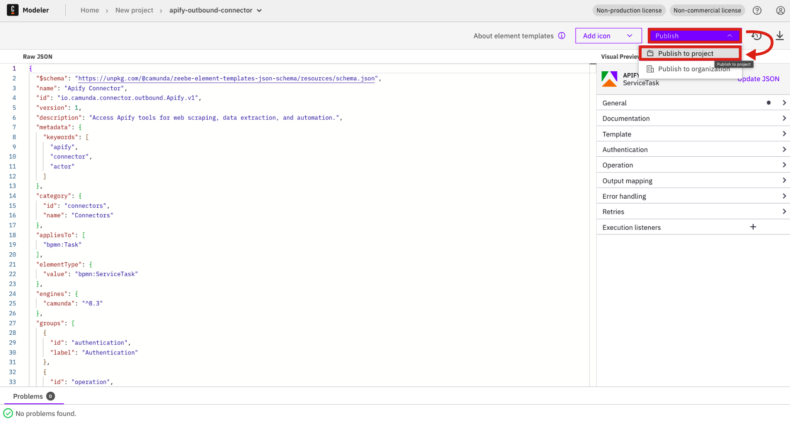
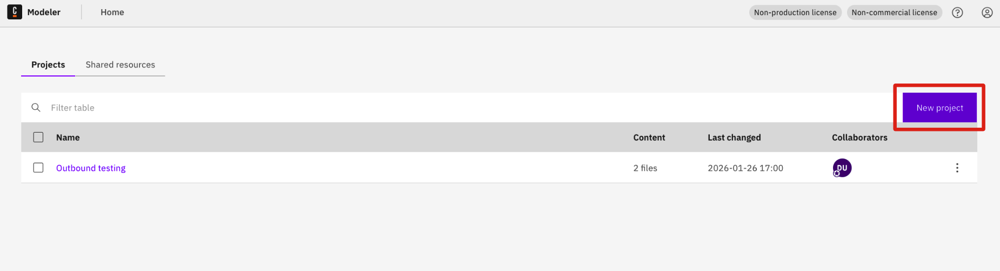
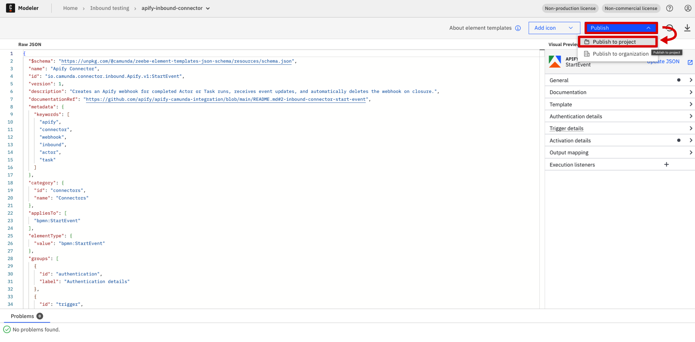
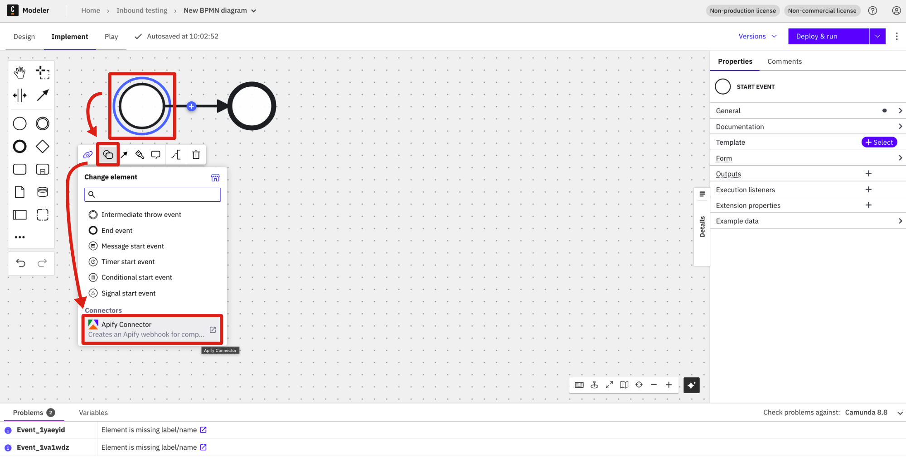
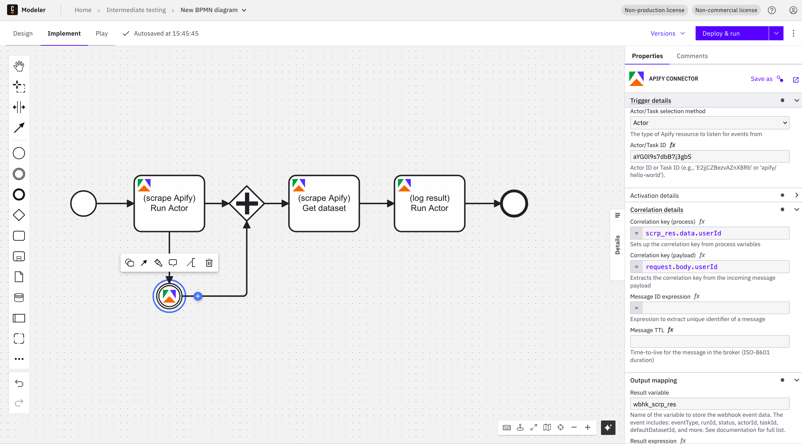

# Apify Camunda Connector

Integrate [Apify](https://apify.com/) web scraping and automation capabilities into your **Camunda 8** workflows. This connector enables you to run Actors, execute tasks, and retrieve data from Apify directly within your BPMN processes.

## Features

**Outbound Operations** (call Apify from your process):
- **Run Actor** - Start an Apify Actor and get results
- **Run Task** - Execute a saved Actor task
- **Get Dataset Items** - Retrieve data from Apify datasets
- **Get Key-Value Store Record** - Fetch stored data by key
- **Scrape Single URL** - Quick web scraping for a single page

**Inbound Operations** (trigger processes from Apify):
- **Start Event** - Start a new process when an Apify webhook fires
- **Intermediate Event** - Pause and wait for an Apify webhook before continuing

---

## Table of Contents

- [Quick Start](#quick-start)
- [Running the Connector](#running-the-connector)
- [Actor ID vs Actor name](#actor-id-vs-actor-name)
- [Using the Outbound Connector](#using-the-outbound-connector)
- [Using the Inbound Connectors](#using-the-inbound-connectors)
  - [Start Event](#start-event)
    - [Actor ID vs Actor Name](#actor-id-vs-actor-name)
  - [Intermediate Event](#intermediate-event)
    - [Understanding FEEL Expressions](#understanding-feel-expressions)
    - [Correlation Key Best Practices](#correlation-key-best-practices)
    - [Activation Condition](#activation-condition)
- [Reference](#reference)
  - [Camunda Architecture](#camunda-architecture)
  - [Service URLs](#service-urls)
- [Troubleshooting](#troubleshooting)

---

## Quick Start

### Prerequisites

- **Java 21** or later
- **Maven 3.8+**
- **Docker** and **Docker Compose**

### 1. Start Camunda Stack

Follow the [Camunda Docker Compose quickstart](https://docs.camunda.io/docs/self-managed/quickstart/developer-quickstart/docker-compose) to spin up the full stack locally.

> **Note:** Install the FULLY configured stack which includes Web Modeler. This connector was tested with [Camunda 8.8](https://github.com/camunda/camunda-distributions/releases/tag/docker-compose-8.8).

### 2. Clone and Build

```bash
git clone https://github.com/apify/apify-camunda-integration.git
cd apify-camunda-integration
mvn clean package
```

### 3. Run the Connector

```bash
mvn test-compile exec:java \
  -Dexec.mainClass="io.camunda.connector.apify.LocalConnectorRuntime" \
  -Dexec.classpathScope=test
```

### 4. Open Web Modeler

Go to http://localhost:8070/ (credentials: `demo` / `demo`) and start creating processes with the Apify connector.

---

## Running the Connector

This section covers how to run the connector locally. The same command is used for both outbound and inbound connectors.

### Environment Variables

For **inbound connectors** (webhooks), you must set `CONNECTOR_BASE_URL` so Apify knows where to send webhook events.

**Option A: Placeholder URL (for initial setup)**

```bash
export CONNECTOR_BASE_URL=http://example.com
```

You can update the webhook URL in Apify later after deploying your process.

**Option B: Using ngrok (recommended for testing)**

This approach allows real-time webhook testing without manually updating URLs.

Install ngrok from [https://ngrok.com/download/](https://ngrok.com/download/).

```bash
ngrok http 9898
```

Copy the generated URL (e.g., `https://abc123.ngrok-free.app`) and set it:

```bash
export CONNECTOR_BASE_URL=https://abc123.ngrok-free.app
```

### Start Command

```bash
mvn test-compile exec:java \
  -Dexec.mainClass="io.camunda.connector.apify.LocalConnectorRuntime" \
  -Dexec.classpathScope=test
```

Keep this terminal running while working with Camunda Modeler.

### Regenerating Element Templates

The templates in `element-templates/` were generated and then customized for Apify. If you want to regenerate the original (base) templates, including all possible versions, use the command below. We use two inbound and one outbound template; several additional inbound templates exist, but you typically shouldn't regenerate unless you're sure, as Apify-specific changes may be lost.


```bash
# Use only if necessary
mvn clean package -Dgenerate.templates=true -X
```

---

## Actor ID vs Actor Name

> **Note:** Currently, only Actor IDs are supported due to a known limitation. Support for Actor names is planned for a future patch.

When configuring connectors, always use the **Actor ID**, not the Actor name:

| Type | Example | Use In Connector? |
|------|---------|-------------------|
| **Actor ID** | `aYG0l9s7dbB7j3gbS` | Yes |
| **Actor Name** | `apify/website-content-crawler` | Planned |
| **Actor Name (with tilde)** | `apify~website-content-crawler` | Planned |

**How to find the Actor ID:**
1. Go to the Actor page on [Apify Console](https://console.apify.com/actors)
2. The ID is in the URL: `https://console.apify.com/actors/aYG0l9s7dbB7j3gbS`
3. Or find it in the Actor's **Settings** tab under "Actor ID"


---

## Using the Outbound Connector

The Outbound connector allows you to call the Apify API from your BPMN process.

**Before you begin:** Ensure both the Camunda stack and the connector are running (see [Running the Connector](#running-the-connector)).

### Setup Steps

1. Go to **Web Modeler** (http://localhost:8070/) and create a new project.


2. Upload the outbound connector template:
   - Template file: `element-templates/apify-outbound-connector.json`


3. **Publish** the connector template to the project.



4. Create a new **BPMN diagram**.


5. Design a process using the **Apify BPMN connector** as a service task.


6. Set the connector input variables and run the process.


7. Verify the run status and result in **Camunda Operate** (http://localhost:8088/).


---

## Using the Inbound Connectors

Inbound connectors listen for webhook events from Apify to trigger or continue processes.

**Before you begin:** Ensure both the Camunda stack and the connector are running with `CONNECTOR_BASE_URL` set (see [Running the Connector](#running-the-connector)).

### Start Event

Use the Start Event to begin a new process instance when an Apify webhook fires (e.g., when an Actor run finishes).

#### Setup Steps

1. Go to **Web Modeler** (http://localhost:8070/) and create a new project (or use an existing one).



2. Upload the inbound connector templates:
   - **Start Event**: `element-templates/apify-inbound-connector.json`
   - **Intermediate Event**: `element-templates/apify-inbound-intermediate-connector.json`

3. **Publish** both templates to the project.



4. Create a new **BPMN diagram**.


5. Design a process with an **Apify Inbound Connector** as the start event.



6. Configure the **Start Event** with:
   - **Token**: Your Apify API token
   - **Resource ID**: The Actor/Task **ID** (see [Actor ID vs Actor Name](#actor-id-vs-actor-name))
   - **Output Variable**: Variable name for the webhook result (e.g., `webhookResult`)

7. **Deploy** the process. This automatically creates a webhook in Apify.


8. Verify the webhook was created in Apify (Actor page → **Integrations** tab).

9. If you used `http://example.com` as the connector base URL, update the webhook URL in Apify to your ngrok URL.

10. **Trigger the event** by running the Actor on Apify.

11. Verify the process in **Camunda Operate** (http://localhost:8088/):
    - Select the **Finished** filter to see completed processes


---

### Intermediate Event

Use the Intermediate Event to launch Actors asynchronously and wait for their completion via webhooks. This enables powerful workflow patterns that aren't possible with synchronous polling.

#### Why Use Intermediate Events?

| Approach | Best For |
|----------|----------|
| `waitForFinish: true` | Simple, single Actor workflows |
| **Intermediate Events** | Parallel Actors, doing work while waiting, event-driven architectures |

**Real-World Use Cases:**

- **Parallel execution**: Launch multiple Actors simultaneously (e.g., scrape 5 competitor websites), do other work (send notifications, prepare templates), then wait for all to complete using parallel gateways
- **Non-blocking workflows**: Start a long-running Actor, perform other tasks in parallel branches, synchronize when the Actor finishes
- **Resource efficiency**: Push-based webhooks instead of polling loops, scales better with many Actors

> **Important**: Use **Parallel Gateways** for multiple Actors. Event-based gateways are exclusive (first event wins) and won't work correctly.

#### How Correlation Works

Unlike Start Events, Intermediate Events need to know **which** process instance to wake up. This is done via **Correlation Keys**.

Think of it as matching tickets:
1. **Correlation key (process)**: A value stored in your process (e.g., `userId` from Actor launch response)
2. **Correlation key (payload)**: The same value extracted from the incoming webhook

When they match, the waiting process continues.

#### Understanding FEEL Expressions

Correlation keys and other connector fields use **FEEL** (Friendly Enough Expression Language), Camunda's expression language for accessing process variables and webhook data.

**Key syntax:**
- Expressions start with `=` (e.g., `=scrp_res.data.userId`)
- Use dot notation to access nested fields (e.g., `request.body.userId`)
- Without `=`, values are treated as literal strings

**Common patterns:**

| Expression | Description |
|------------|-------------|
| `=myVariable` | Access a process variable |
| `=response.data.id` | Access nested field from a variable |
| `=request.body.userId` | Access field from incoming webhook payload |
| `="literal"` | Literal string value |

**In the context of this connector:**
- **Process expressions** (like `=scrp_res.data.userId`) reference variables set earlier in the process
- **Payload expressions** (like `=request.body.userId`) reference fields in the incoming webhook HTTP request

For more details, see [Camunda FEEL documentation](https://docs.camunda.io/docs/components/modeler/feel/what-is-feel/).

#### Tutorial: Setting Up Correlation

The following example demonstrates how to configure correlation keys and the recommended pattern using parallel gateways.

**Flow Overview:**

```
                              ┌───→ [flow can continue here] ────┐
[Start] → [Run Scraper] → [Fork]                              [Join] → ... → [End]
                              └───→ [Wait for Webhook] ──────────┘
```



> **Why use a Parallel Gateway?** Place the Intermediate Event in a parallel branch immediately after the async Actor launch. This ensures the webhook listener is active before the Actor could finish. If you place the Intermediate Event too far down the main flow, a fast Actor might complete before the process reaches the waiting state, causing the webhook to be missed.

**1. Start Event**

Add a regular Start Event to begin the process.

**2. Run Actor (Website Content Crawler) - Async Launch**

Configure the outbound connector to scrape apify.com:

| Setting | Value |
|---------|-------|
| **Operation** | Run Actor |
| **Actor ID** | `aYG0l9s7dbB7j3gbS` (Website Content Crawler) |
| **Input JSON** | `{"startUrls":[{"url":"https://apify.com"}],"maxCrawlPages":1}` |
| **Wait for Finish** | `false` (critical!) |
| **Result Variable** | `scrp_res` |
| **Result Expression** | `=scrp_res` |

> **Important**: Set `Wait for Finish` to `false` so the Actor launches asynchronously.

**3. Parallel Gateway (Fork)**

Add an **Inclusive Gateway** (or Parallel Gateway) immediately after the Run Actor task. This splits the flow into branches:
- **Branch 1**: The Intermediate Event that waits for the webhook
- **Branch 2**: Any other work you want to do while waiting (optional)

**4. Intermediate Event (Wait for Webhook)**

In one branch, add an Apify Inbound Intermediate Event to wait for the Actor to complete:

| Setting | Value |
|---------|-------|
| **Token** | Your Apify API token |
| **Resource Type** | Actor |
| **Resource ID** | `aYG0l9s7dbB7j3gbS` (same Actor) |
| **Correlation key (process)** | `=scrp_res.data.userId` |
| **Correlation key (payload)** | `=request.body.userId` |
| **Result Variable** | `wbhk_scrp_res` |
| **Result Expression** | `=wbhk_scrp_res` |

**Where do these values come from?**

- **`scrp_res.data.userId`**: This comes from the [Run Actor API response](https://docs.apify.com/api/v2#/reference/actors/run-collection/run-actor). When you start an Actor, Apify returns a JSON object containing run details including `userId`, `id` (runId), `defaultDatasetId`, etc.

- **`request.body.userId`**: This comes from the webhook payload that Apify sends when the Actor completes. The webhook body contains the same fields. See [Apify Webhooks documentation](https://docs.apify.com/platform/integrations/webhooks) for the full payload structure.

This branch will pause until the Actor completes and sends a webhook.

**5. Parallel Gateway (Join)**

Add another Inclusive/Parallel Gateway to merge the branches. The flow continues only after all branches complete (including the webhook being received).

**6. Get Dataset Items**

After the join, retrieve the scraped data from the Actor's dataset:

| Setting | Value |
|---------|-------|
| **Operation** | Get Dataset Items |
| **Dataset ID** | `=scrp_res.data.defaultDatasetId` |
| **Result Variable** | `data_res` |
| **Result Expression** | `=data_res` |

**7. Run Actor (Hello World) - Log Results**

Use Hello World Actor to verify the gathered data:

| Setting | Value |
|---------|-------|
| **Operation** | Run Actor |
| **Actor ID** | `E2jjCZBezvAZnX8Rb` (Hello World) |
| **Input JSON** | `{"message": data_res}` |
| **Wait for Finish** | `true` |

**8. Deploy and Test**

1. Deploy & start the process
1. The scraper launches asynchronously
1. The parallel gateway splits: one branch immediately starts waiting for the webhook
1. When the Actor completes, Apify sends a webhook
1. The webhook wakes up the waiting branch (correlation keys match on `userId`)
1. The join gateway waits for all branches to complete
1. Dataset items are retrieved and passed to Hello World Actor


#### Tips

**Correlation Key Best Practices**

Correlation keys ensure that incoming webhooks are matched to the correct waiting process instance. Choose the right key based on your use case:

| Correlation Key | Process Expression | Payload Expression | Best For |
|-----------------|-------------------|-------------------|----------|
| **User ID** | `=scrp_res.data.userId` | `=request.body.userId` | Single Apify account, simple workflows |
| **Actor Run ID** *(planned)* | `=scrp_res.data.id` | `=request.body.actorRunId` | Multiple concurrent runs of the same Actor |

**Current limitation:** Only `userId` is available in webhook payloads. Support for `actorRunId` correlation is planned for a future release, which will enable more precise matching when running multiple instances of the same Actor concurrently.

**Recommendations:**
- For most use cases with a single Apify account, `userId` correlation is sufficient
- If you need to run the same Actor multiple times in parallel within different process instances, consider using unique identifiers in your workflow design until `actorRunId` support is added
- Always test correlation in a development environment before deploying to production

**Activation Condition**

The **Activation Condition** is a _FEEL expression_ that filters which webhook events should wake up the waiting process. Only webhooks where the condition evaluates to `true` will activate the intermediate event.

Apify webhooks fire for multiple event types: `Run succeeded`, `Run failed`, `Run timed out`, and `Run aborted`. Without an activation condition, any of these events will continue your process.

**Common patterns:**

| Condition | Effect |
|-----------|--------|
| *(empty)* | Accept all webhook events |
| `=request.body.eventType = "Run succeeded"` | Only continue on successful runs |
| `=request.body.eventType != "Run failed"` | Continue on any non-failure status |

**Example:** To only proceed when an Actor completes successfully:
```
=request.body.eventType = "Run succeeded"
```

This prevents your workflow from continuing (and potentially failing) when an Actor run times out or encounters an error. You can combine this with error boundary events to handle failure cases separately.

**Timeouts**
- Add a **Timer Boundary Event** for timeout handling when Actors may take longer than expected

---

## Reference

This section contains detailed technical information about the Camunda platform.

### Camunda Architecture

The Camunda platform consists of several services:

```
┌─────────────────────────────────────────────────────────────────────────────┐
│                        Connector Runtime                                    │
│                      (LocalConnectorRuntime)                                │
└─────────────────────────────┬───────────────────────────────────────────────┘
                              │
              ┌───────────────┴───────────────┐
              │                               │
              v                               v
┌─────────────────────────┐       ┌───────────────────────────────────────────┐
│      Keycloak           │       │         Orchestration Service             │
│      :18080             │       │    (Zeebe + Operate + Tasklist)           │
│                         │       │                                           │
│  Realm: camunda-platform│       │   gRPC API: localhost:26500               │
│  Admin: admin/admin     │       │   REST API: localhost:8088                │
│                         │       │                                           │
│  OAuth Clients:         │       │   Audience: orchestration-api             │
│  - connectors           │       │                                           │
│  - orchestration        │       └───────────────────────────────────────────┘
│  - console              │                         │
└─────────────────────────┘                         │
                                                    v
                                        ┌───────────────────────┐
                                        │    Elasticsearch      │
                                        │       :9200           │
                                        └───────────────────────┘
```

**Components:**

- **Orchestration Service** - Core workflow engine containing:
  - **Zeebe** - Executes BPMN processes, handles job workers, manages process state
  - **Operate** - Web UI for monitoring processes and investigating incidents
  - **Tasklist** - Web UI for managing human tasks

- **Keycloak** - Identity provider for OAuth 2.0 / OIDC authentication

- **Elasticsearch** - Stores process execution data for Operate and Tasklist

- **Web Modeler** - Browser-based BPMN diagram editor

- **Connector Runtime** - Executes connector logic (outbound API calls, inbound webhooks)

### Service URLs

| Service | URL | Credentials | Purpose |
|---------|-----|-------------|---------|
| **Web Modeler** | http://localhost:8070/ | `demo` / `demo` | BPMN diagram editor |
| **Operate/Tasklist** | http://localhost:8088/ | `demo` / `demo` | Process monitoring |
| **Console** | http://localhost:8087/ | `demo` / `demo` | Cluster management |
| **Optimize** | http://localhost:8083/ | `demo` / `demo` | Process analytics |
| **Identity** | http://localhost:8084/ | - | User/role management |
| **Keycloak Admin** | http://localhost:18080/auth/admin | `admin` / `admin` | OAuth configuration |
| **Elasticsearch** | http://localhost:9200/ | - | Data storage |
| **Mailpit** | http://localhost:8075/ | - | Email testing |

> **Note:** For API endpoints and Keycloak OAuth client configuration details, see [`src/test/resources/application.properties`](src/test/resources/application.properties).

---

## Troubleshooting

### Common Issues

| Issue | Solution |
|-------|----------|
| Webhook not received | Ensure ngrok is running and `CONNECTOR_BASE_URL` is set to the ngrok URL |
| "Resource ID not found" | Use the Actor/Task **ID** (e.g., `abcdef123456`), not the name with tilde (e.g., `username~actor-name`) |
| Process not visible in Operate | Check the **Finished** filter - completed processes may not show in default view |
| Connector crashes on startup | Ensure `CONNECTOR_BASE_URL` environment variable is set |
| `ProcessDefinitionImporter` errors | Ensure `audience=orchestration-api` in config (not `zeebe-api`) |
| `Failed to apply credentials` (400) | Check OAuth client credentials match Keycloak config |
| gRPC connection failed | Ensure `grpc-address` uses `grpc://` protocol (not `http://`) |

### Cleaning Up Stale Webhooks

During testing, you may accumulate webhooks. To start fresh:

```bash
cd docker-compose-8.8
docker compose -f docker-compose-full.yaml down -v
docker compose -f docker-compose-full.yaml up -d
```

> **Warning:** This deletes all data including deployed processes and webhooks. Webhooks created in Apify must be deleted manually in the Apify console.
