# Apify Camunda Connector

This connector is used to interact with the Apify API in the **Camunda 8** environment. It includes both **Outbound** and **Inbound** connectors.

---

## Table of Contents

- [Prerequisites (shared setup)](#prerequisites-shared-setup)
- [Connector Types](#connector-types)
  - [Outbound Connector](#1-outbound-connector)
  - [Inbound Connector (Start Event)](#2-inbound-connector-start-event)
  - [Inbound Connector (Intermediate Event)](#3-inbound-connector-intermediate-event)
- [Troubleshooting](#troubleshooting)

---

## Prerequisites (Shared Setup)

Follow these steps to set up the environment for both _Outbound_ and _Inbound_ connectors.

### 1. Camunda Stack in Docker

Locally spin up a Camunda stack using _Docker Compose_ following [this quickstart guide](https://docs.camunda.io/docs/self-managed/quickstart/developer-quickstart/docker-compose).

> **Note:** Make sure to install FULLY configured Camunda stack which includes the Modeler.

In case you want to choose a specific version, you can find their `docker-compose.yaml` files in [Camunda's official repository](https://github.com/camunda/camunda-distributions/tree/main/docker-compose/versions).

> **Note:** When developing this connector, we used the [Camunda 8.7](https://github.com/camunda/camunda-distributions/releases/download/docker-compose-8.7/docker-compose-8.7.zip) version.

### 2. Clone and Build the Connector

Clone this repository and build the connector:

```bash
git clone https://github.com/apify/apify-camunda-integration.git

cd apify-camunda-integration

mvn clean package
```

### 3. Useful URLs

Once the Camunda stack is running, you can access the following services:

| Service | URL | Credentials (username / password) |
|---------|-----|-------------|
| **Web Modeler** | http://localhost:8070/ | `demo` / `demo` |
| **Camunda Operate** | http://localhost:8081/operate | `demo` / `demo` |
| **Camunda Tasklist** | http://localhost:8082/tasklist | `demo` / `demo` |

---

## Connector Types

The _Camunda_ provides two types of connectors:

1. **Outbound Connector** - Calls the Apify API to run Actors, tasks, or retrieve datasets
2. **Inbound Connector** - Listens for webhook events from Apify to trigger or continue processes

---

## 1. Outbound Connector

The Outbound connector allows you to call the Apify API from your BPMN process.

### Run the Outbound Connector Locally

**Important:** Before proceeding with Camunda Modeler, make sure both the Camunda stack and your connector are running locally.

1. Ensure your Camunda stack is running in Docker.

2. Start the local runtime to expose your connector:

```bash
mvn test-compile exec:java -Dexec.mainClass="io.camunda.connector.apify.outbound.LocalConnectorRuntime" -Dexec.classpathScope=test
```

Keep this terminal running while you work with Camunda Modeler.

### Set up and Test the Outbound Connector

1. Go to **Web Modeler** (http://localhost:8070/) and create a new project.

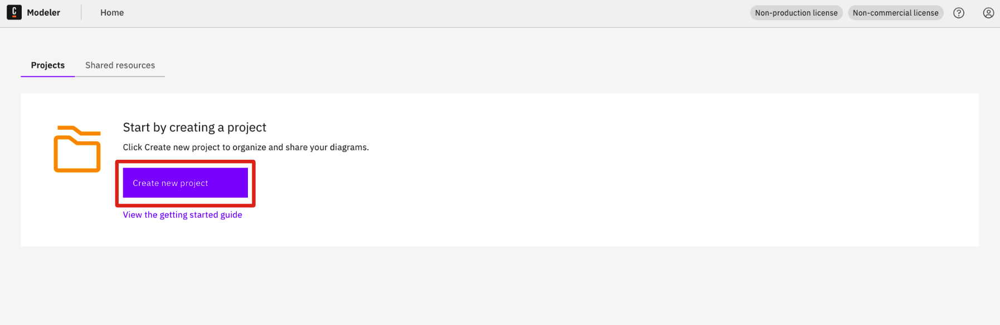

2. Upload the outbound connector template JSON:
   - Template file: `element-templates/apify-outbound-connector.json`


3. **Publish** the connector template to the project.

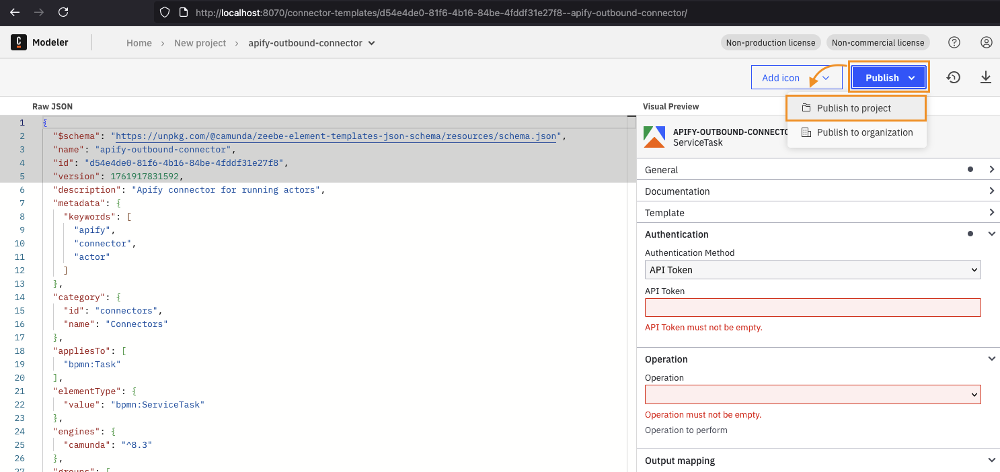

4. Create a new **BPMN diagram**.

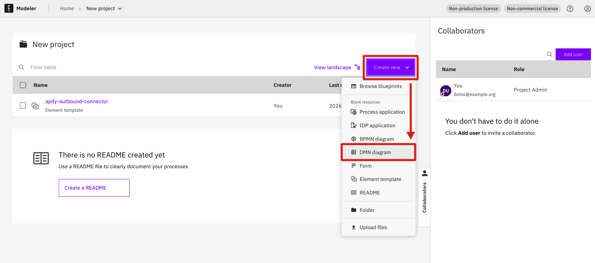

5. Design a process using the **Apify BPMN connector** as a BPMN service task.


6. Set the connector input variables and run the process.


7. Verify the run status and result in **Camunda Operate** (http://localhost:8081/operate).

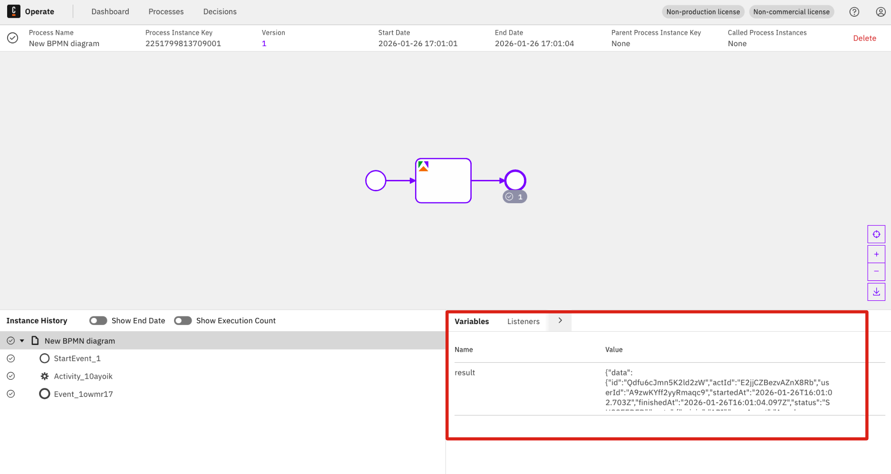

---

## 2. Inbound Connector (Start Event)

The Inbound connector listens for webhook events from Apify. When a configured event occurs (e.g., Actor run finished), Apify sends a webhook to your connector, which then triggers a new process instance in Camunda.

### Set Up Environment Variables

Since the inbound connector runs on your local machine and needs to receive webhooks from Apify, you must configure the `CONNECTOR_BASE_URL` environment variable.

**Option A: Using a placeholder URL (for initial setup)**

```bash
export CONNECTOR_BASE_URL=http://example.com
```

**Option B: Using ngrok for actual webhook testing (recommended)**

> **Note:** This approach simplifies iterative development by eliminating the need to repeatedly update the webhook URL for testing.

1. Install [ngrok](https://ngrok.com/) if you haven't already.

2. Start ngrok to expose port 9898 (the default port for the inbound connector):

```bash
ngrok http 9898
```

3. Copy the generated public URL (e.g., `https://abc123.ngrok.io`) and set it:

```bash
export CONNECTOR_BASE_URL=https://abc123.ngrok.io
```

### Run the Inbound Connector Locally

Start the local runtime:

```bash
mvn test-compile exec:java -Dexec.mainClass="io.camunda.connector.apify.inbound.LocalConnectorRuntime" -Dexec.classpathScope=test
```

Keep this terminal running while you work with Camunda Modeler.

### Set up and Test the Inbound Connector

1. Go to **Web Modeler** (http://localhost:8070/) and create a new project (or use an existing one).


2. Upload the inbound connector templates:
   - **Start Event template**: `element-templates/apify-inbound-connector.json`
   - **Intermediate Event template**: `element-templates/apify-inbound-intermediate-connector.json`

3. **Publish** both templates to the project.
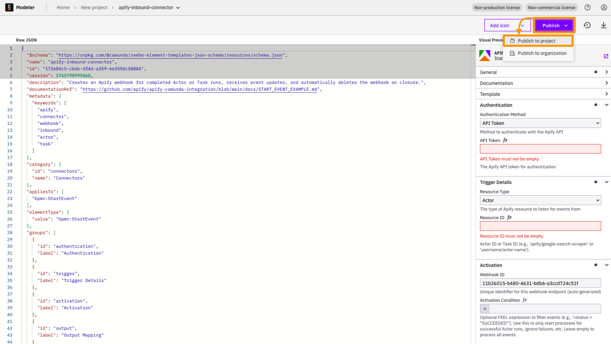

4. Create a new **BPMN diagram**.
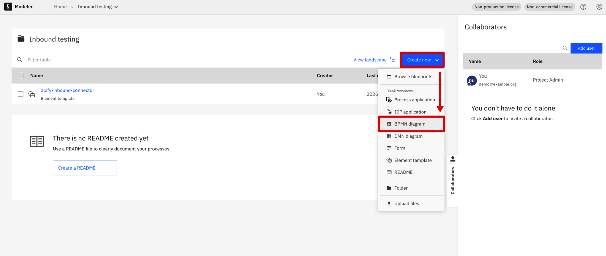

5. Design a process with the following structure:
   - **Start Node**: Select the Apify Inbound Connector as the start event
   - **End Node**: Add an end event
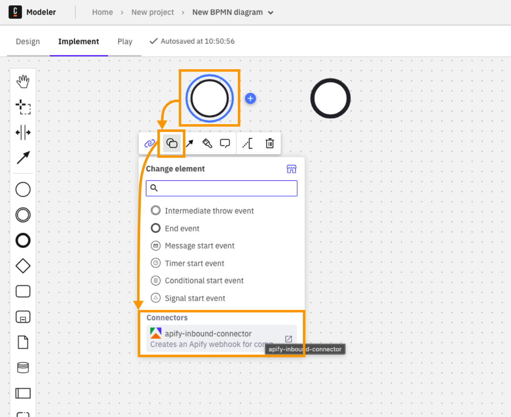

6. Configure the **Start Node** with:
   - **Token**: Your Apify API token (OAuth is not yet implemented)
   - **Resource ID**: Use the **Actor/Task ID** (not the name with tilda `~`), e.g., `abcdef123456`
   - **Output Variable**: Create a variable name where the webhook result will be stored (e.g., `webhookResult`)

7. **Deploy** the process. This will automatically create a webhook in Apify.

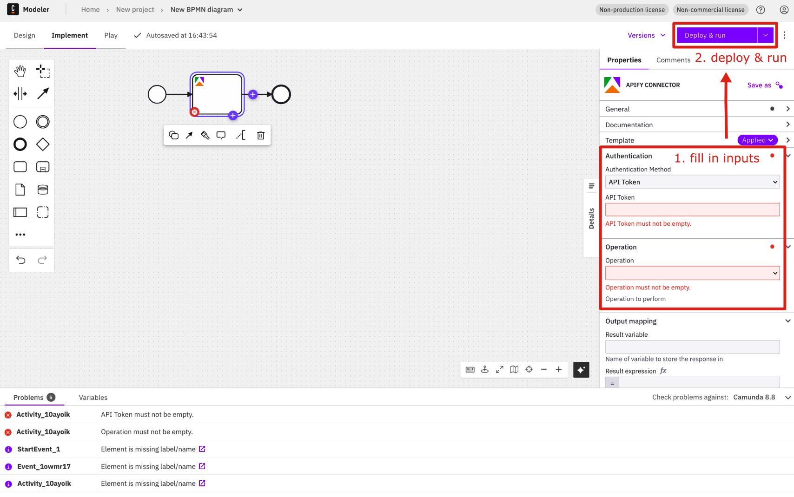

8. Verify the webhook was created:
   - Go to the Actor page on Apify
   - Navigate to the **Integrations** tab
   - You should see the newly created webhook

9. **If you used `http://example.com` as the connector base URL:**
   - Start ngrok: `ngrok http 9898`
   - Go to the webhook in Apify and update the URL to use your ngrok URL instead of `http://example.com`

10. **Trigger the event** (e.g., run the Actor on Apify).

11. Verify the process was triggered in **Camunda Operate** (http://localhost:8081/operate):
    - Navigate to the process instances
    - **Select "Finished" filter** to see completed processes
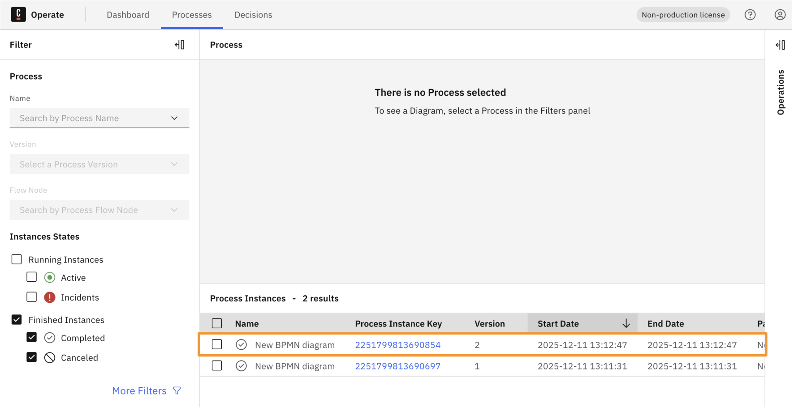
    - Check the returned data in the process variables
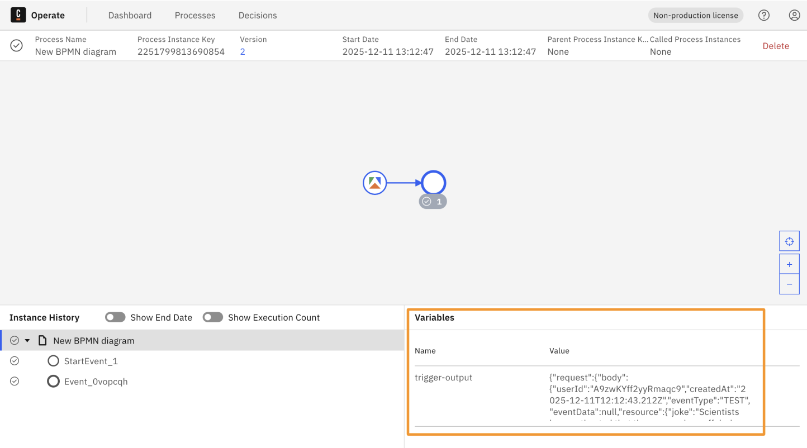
---

## 3. Inbound Connector (Intermediate Event)

The Intermediate Event connector allows you to pause a running process and wait for an Apify webhook event before continuing. This is perfect for long-running Actors where you want to continue the process only when the specific run finishes.

> **Prerequisite:** Before setting up the intermediate event, ensure you have followed the [Inbound Connector (Start Event)](#2-inbound-connector-start-event) instructions for **Setting up Environment Variables** and **Running the Connector Locally**.

The intermediate event connector template is available at:
- `element-templates/apify-inbound-intermediate-connector.json`

### How Correlation Works

Unlike the Start Event, an Intermediate Event needs to know **which** specific process instance to wake up. This is done via **Correlation Keys**.

Think of it as matching a ticket:
1. **Correlation key (process)**: The "Ticket Number" stored in your process (e.g., a `userId` or `runId` from a previous step).
2. **Correlation key (payload)**: The "Ticket Number" found in the incoming Apify webhook.

When they match, the process continues.

### Set up and Test the inbound connector events (start and intermediate)

This setup is a demonstration of how the **Inbound Start Event** and **Inbound Intermediate Event** work together using correlation. While this specific flow (linking two webhooks by userId) is a test example, it illustrates the core mechanics of process continuation.

1. **Design your BPMN process**:
   - Start with an **Apify Inbound Start Event** (or any other start event).
   - Add an **Apify Inbound Intermediate Event** later in the flow.
   - Select the **Apify Inbound Intermediate Event** template for the catch event.

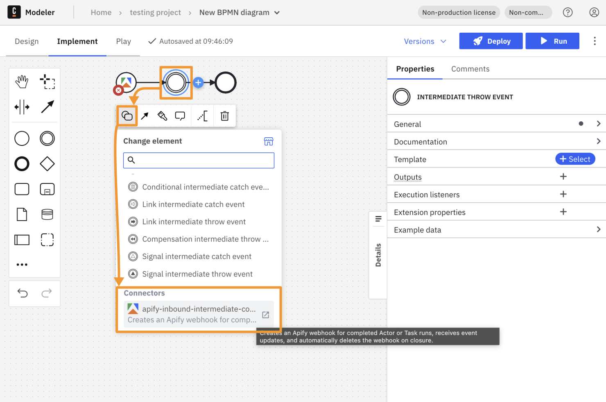

2. **Configure the Start Event**:
   - Set the **Result Variable** to `start_res`.
   - This variable will store the payload data from the first webhook, including the `userId` or `runId`.

3. **Configure the Intermediate Event**:
   - **Authentication & Trigger**: Set your token and the Actor/Task ID you want to wait for.
   - **Correlation key (process)**: `=start_res.request.body.userId` (matches the ID stored from the start).
   - **Correlation key (payload)**: `=request.body.userId` (extracts the ID from the incoming webhook).
   - **Result Variable**: Set to `inter_res`.

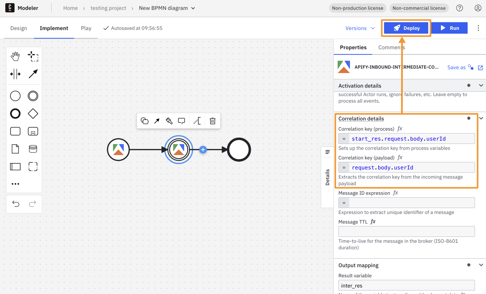

4. **Deploy and Run**:
   - **Deploy** the process to your Camunda instance.
   - **Trigger the Start Event**: Run the first Actor on Apify. You will see a new process instance waiting at the Intermediate Event in **Camunda Operate**.
   - **Trigger the Intermediate Event**: Run the second Actor on Apify.
   - **Match**: If the `userId` (or `runId`) matches, the process instance will successfully finish.

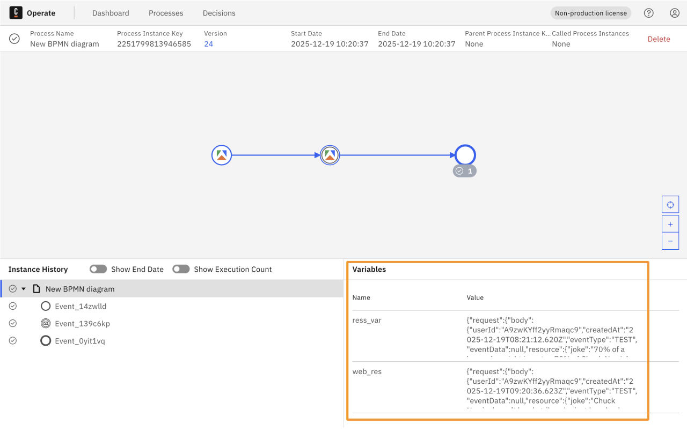

---

## Troubleshooting

### Cleaning Up Stale Webhooks

During testing, you may accumulate webhooks in the Camunda background. Currently, there's no automated way to delete these webhooks from within the connector (at least not that I know of).

**To start fresh:**

1. Navigate to the docker folder:
```bash
cd docker-compose-8.7
```

2. Stop and remove all containers and volumes:
```bash
docker-compose down -v
```

3. Start the stack again:
```bash
docker-compose up -d
```

**Note:** This will delete all your data including deployed processes, process instances, and webhooks.

**Note:** This won't delete created webhooks in Apify. You can delete them manually in the Apify console.

### Common Issues

| Issue | Solution |
|-------|----------|
| Webhook not received | Ensure ngrok is running and `CONNECTOR_BASE_URL` is set correctly to the ngrok URL |
| "Resource ID not found" | Use the Actor/Task **ID** (e.g., `abcdef123456`), not the name with tilda (e.g., `username~actor-name`) |
| Process not visible in Operate | Check the **Finished** filter - completed processes may not show in the default view |
| Connector crashes on startup | Ensure `CONNECTOR_BASE_URL` environment variable is set |
